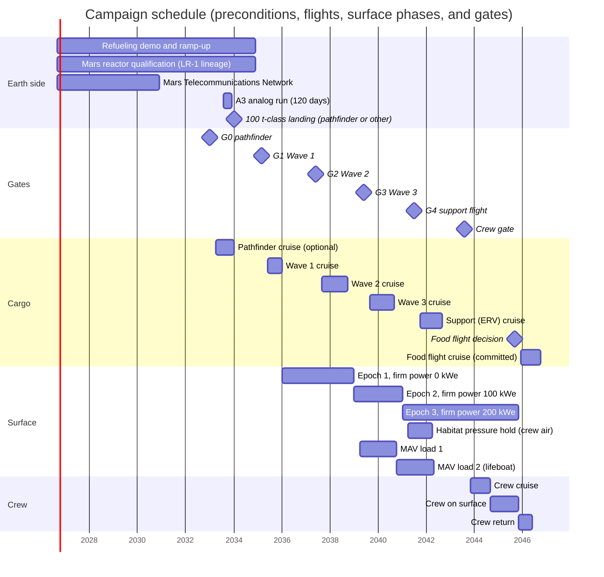

# 13. Timeline and gates

*Last reviewed: September 28, 2026*

*Scenario, mission control and Arcadia Planitia, August 2043.* The launch decision review takes four hours on Earth, and every question to the colony costs 36 minutes of round-trip light time. Nobody on Earth asks the Orchestrator for an opinion; they ask for readings. Reactor 3 has carried firm power for more than two and a half years, and the habitat has held crew air since April 2041. The ascent vehicle's methane and oxygen have sat in its tanks for nearly three years; the Earth return vehicle has circled Mars for one. The colony came through the February conjunction and an April regional dust storm without a single command from Earth. The last question of the day goes to the lifeboat tanks, and the answer comes back: a pressure trace that has not moved in more than a year. Four people will leave in November.

Each piece of the colony has a date by which it must exist, and each flight has conditions that must hold before it leaves Earth. Ships leave for Mars only in launch windows about 26 months apart, so a wave that misses its window waits two years.

In brief: three cargo waves launch in June 2035, September 2037, and September 2039; a support flight carries the Earth return vehicle and a support lander in October 2041; and the first crew of four departs in November 2043, if the crew gate passes about three months earlier. Four items can hold the first wave: orbital refueling, a Mars-qualified reactor, site autonomy, and heavy-lander entry, descent, and landing (EDL). If refueling, the reactor, or EDL is late, Wave 1 moves by one or two windows, and because the windows after 2035 come closer together, the first crew moves by two or three: it departs around April 2048 or May 2050. Autonomy that falls short lets Wave 1 fly but slows the build. At half the planned rate Wave 2's landing sites are not ready in time, so Wave 2 waits a window, and the crew moves at least one window, to January 2046, and likely two.

## Requirements

The launch windows, the three waves and their firm-power steps of 0, 100, and 200 kWe, the propellant schedule, and the six technical crew gate conditions come from [chapter 2](02.%20Baseline%20and%20budgets.md); [chapter 12](12.%20Human%20readiness%20and%20health.md) adds nine human criteria. Dates this chapter adds are marked as assumptions. All wave and crew gate criteria must be achievable at autonomy level A3, as defined in [chapter 1](01.%20Mission%20concept%20and%20autonomy.md).

## Windows about 26 months apart set the calendar

A minimum-energy trip from Earth to Mars is possible only when the two planets line up, which happens once per synodic period of 779.9 days, or 25.6 months [2]: in NASA's summary, a window about every 26 months [3]. Because Mars's orbit is eccentric, individual gaps between optimum departure dates run from 22 to 28 months, and the calendar does not favor even or odd years.

| Opportunity | Optimum departure | Characteristic energy C3 (km²/s²) | Arrival | Role in this plan |
|---|---|---:|---|---|
| 2033 | Apr 28, 2033 | 7.8 | Jan 2034 | Optional pathfinder |
| 2035 | Jun 23, 2035 | 10.2 | Jan 2036 | Wave 1 |
| 2037 | Sep 7, 2037 | 14.8 | Oct 2038 | Wave 2 |
| 2039 | Sep 28, 2039 | 12.2 | Sep 2040 | Wave 3 |
| 2041 | Oct 19, 2041 | 9.8 | Sep 2042 | Support: Earth return vehicle (ERV) and a support lander with food and spares |
| 2043 | Nov 15, 2043 | 9.0 | Sep 2044 | First crew |
| 2045/46 | Jan 22, 2046 | 8.6 | Dec 2046 | Expansion, with the next crew's ERV and ascent vehicle; a food flight that leaves early, Dec 4–18, 2045, and lands about Oct 2046 with at least 2.6 t of food, a pharmacy resupply, suit consumables, and robot spares, which cover a missed return window |
| 2048 | ~Apr 4, 2048 | ~7.9 | ~Jan 2049 | Next crew, leaving about late Jan 2048 and landing about late Oct 2048; expansion |

The 2037 and 2039 windows are the most expensive of the period, with C3 90% and 56% higher than in 2033. Cargo ships take on only the propellant their transfer needs, so the landed payload stays the same and the cost appears as propellant. Nine tanker flights per ship at 100 t per tanker cover every window from 2035 to 2043, because each ship carries propellant for the worst day of its launch period, and the expensive windows need up to 12 in the pessimistic case ([chapter 4](04.%20Transportation%20and%20landing.md)). Real launch periods span 3–6 weeks around each optimum [1]; each wave's ships leave over about four weeks of it.

Two recurring Mars events shape the surface schedule. Solar conjunction stops commands from Earth every ~26 months, for about two weeks in past missions and for the 21–28 days this plan books ([chapter 10](10.%20Communications.md)). The dust season falls in southern spring and summer, when Mars is near perihelion. Regional storms that last weeks happen every Mars year, and planet-encircling storms about once every three [20]; the last three came in 2001, 2007, and 2018 [4], [5]. The dates below are computed from a two-body ephemeris that reproduces the 2019–2026 conjunctions and from the 687-day Mars year, counted from the start of Mars Year 37 on December 26, 2022.

| Mars year | Dust season (southern spring and summer, approx.) | Solar conjunction (approx.) | Campaign phase |
|---|---|---|---|
| 43 | Apr 2035–Feb 2036 | Aug 19, 2034 | Pathfinder on surface; Wave 1 lands in the dust season |
| 44 | Mar 2037–Jan 2038 | Sep 24, 2036 | Wave 1 operations |
| 45 | Jan 2039–Nov 2039 | Nov 1, 2038 | Wave 2 operations |
| 46 | Dec 2040–Oct 2041 | Dec 18, 2040 | Wave 3 operations; firm 200 kWe |
| 47 | Nov 2042–Sep 2043 | Feb 21, 2043 | Crew gate evidence period |
| 48 | Sep 2044–Jul 2045 | May 2, 2045 | Crew on surface |

Wave 1 arrives in January 2036, late in a dust season, so its landers must be able to land and deploy under a dusty sky. The first crew lands in September 2044, just as the next dust season begins.

## Earth-side preconditions, 2026–2034

The 2035 start depends on five capabilities on Earth or the Moon existing in time. The plan's cargo masses fit any heavy lander, which matters because in February 2026 SpaceX said it had shifted its focus to the Moon and would begin building a Mars city in about five to seven years [6].

> Assumption: Wave 1 departs in June 2035, the earliest window that leaves time to qualify a Mars reactor on the Lunar Reactor-1 lineage by 2034 and to make orbital refueling routine.

| Precondition | Status, Sep 2026 | Needed by | If late |
|---|---|---|---|
| Ship-to-ship cryogenic propellant transfer, then routine refueling at about 9 tanker flights per ship | Transfer inside one vehicle done on Starship Flight 3 (March 2024); the ship-to-ship demonstration slipped from March 2025 to March 2026 [19] and was still unscheduled in September 2026 [9] | Demonstration before 2033, in time for the pathfinder's eight tanker flights from about mid-March 2033; routine operations by the Wave 1 gate, March 2035 | Wave 1 slips to 2037 or 2039 |
| 100 kWe-class reactor qualified for Mars | The August 2025 directive asked for a lunar reactor of at least 100 kWe by about 2030 [7], reaffirmed by NASA and the Department of Energy in January 2026 [8]. The first unit, Lunar Reactor-1 (LR-1), is to land on the Moon in 2030 [16]; its August 2026 draft procurement reportedly asks for at least 20 kWe [17], with no hardware contract. Units of the 100 kWe class are a 2030s goal [18] | Mars unit qualified by 2034, building on LR-1; no 100 kWe lunar flight required | Wave 1 slips to 2037: the 20 kWe-class units that could replace one reactor weigh about 60 t more, beyond Wave 1's margin (chapter 5) |
| Mars Telecommunications Network | Blue Origin selected September 1, 2026; delivery by December 31, 2028; operational at Mars by 2030 [10]; award under protest at the U.S. Government Accountability Office since September 11, 2026, contract suspended until a ruling due by about December 20, 2026 [11] | Before Wave 1 lands in January 2036: about 2030 on a launch in the December 2028 window, about 2032 on the next ([chapter 10](10.%20Communications.md)) | No wave slips; Wave 1 uses its direct-to-Earth terminal (chapter 10) |
| Heavy-lander EDL on Mars | Heaviest mass landed so far is Perseverance, a 1,025 kg rover [12] | At least one successful 100 t-class landing before the Wave 1 gate, by the pathfinder or another program's lander | Wave 1 becomes an EDL test and slips one window; the crew slips two ("Schedule logic") |
| Site autonomy at A3 | Building blocks in Earth tests; not demonstrated on any planetary surface (chapter 1) | 120-day uncrewed analog run of a Wave 1 robot set, by 2033 | Wave 1 flies with more Earth supervision; Wave 2 and the crew slip ("Schedule logic") |

Four of these are on the critical path: refueling, the reactor, EDL, and autonomy. The register rates each at impact 4 or 5 ([R08](Appendix%20A.%20Risk%20register.md#r08), [R16](Appendix%20A.%20Risk%20register.md#r16), [R14](Appendix%20A.%20Risk%20register.md#r14), [R17](Appendix%20A.%20Risk%20register.md#r17)). The relay network is off the critical path because the colony carries an independent path to Earth ([R18](Appendix%20A.%20Risk%20register.md#r18)).

## Six decisions, each about three months before a window

A gate is a decision taken on Earth, from evidence logged on Mars, to commit the next flight: G0 for the optional pathfinder, G1 to G3 for the cargo waves, G4 for the support flight, and the crew gate.

> Assumption: Each gate decision is taken about three months before the optimum departure of the window it commits, the same lead [chapter 2](02.%20Baseline%20and%20budgets.md) uses for the crew gate. Three months is a planning choice, not an agency rule; it puts each decision ahead of the tanker campaign, whose filling begins about 30 days before the launch period opens ([chapter 4](04.%20Transportation%20and%20landing.md)). In the 2045/46 and 2048 windows, whose ships leave weeks before the optimum so as to arrive slowly enough to enter (chapter 4), the three months count from the ships' own departure: about early September 2045 and late October 2047.

| Gate | Decision (approx.) | Commits | Evidence period on Mars |
|---|---|---|---|
| G0 | Jan 2033 | Optional pathfinder | none (Earth-side only) |
| G1 | Mar 2035 | Wave 1 | Pathfinder data, if flown (landed Jan 2034), or another program's heavy landing |
| G2 | Jun 2037 | Wave 2 | ~17 months of Wave 1, including the well proof |
| G3 | Jun 2039 | Wave 3 | ~8–9 months of Wave 2 plus Wave 1 history |
| G4 | Jul 2041 | Support flight (ERV and support lander) | ~10 months of Wave 3 |
| Crew gate | Aug 2043 | First crew | the full campaign; chapter 2 and chapter 12 criteria |

The committed food flight of the 2045/46 window has no gate, because it flies whatever the colony reports, but its cargo is fixed about early September 2045, three months before it leaves in early December, with the same lead as the gates. The stores that cover a missed return window fly in every case, since the crew leaves Mars only in early November, after that decision; about 4.8 t of fresh surface food is added if the crew has slipped to the same window ([chapter 4](04.%20Transportation%20and%20landing.md)).

Who holds the gates is still open (see "Open questions"); the plan asks only that the gate authority be agreed before G1.

## Pathfinder, 2033 (optional)

One heavy lander departs about April 28, 2033, in the cheapest window of the period, and lands in January 2034. It carries survey robots, a small solar-powered in situ resource utilization test, and a communications node.

The pathfinder's main job is to prove that a 100 t-class lander can enter, descend, and land on Mars at the reference site. For the Wave 1 gate it must land intact within the planned ellipse, confirm with ground-penetrating radar and drill data that ice lies within reach of Rodwell wells at the reference site ([chapter 3](03.%20Site%20selection.md)), and run its robots at A3 for at least 120 sols, including the August 2034 conjunction without commands.

If the pathfinder does not fly, the Wave 1 gate needs equivalent evidence from someone else's heavy landing, such as a SpaceX Mars flight in the 2031 or 2033 window. The reactor then rides the second Wave 1 ship, so the first touchdown's data can update its aim point ([chapter 4](04.%20Transportation%20and%20landing.md)). Without the pathfinder, Wave 1 also loses the drilled primary site and commits to Arcadia with ice confirmed only by orbital data and its own survey, and DTN (delay- and disruption-tolerant networking) first runs on Mars over Wave 1's direct link, so the phase F2 exit that G2 reads carries its proof ([chapter 10](10.%20Communications.md)). The backup region, Deuteronilus Mensae, stays an orbital judgment either way (chapter 3, [R05](Appendix%20A.%20Risk%20register.md#r05)).

The Wave 1 target freezes about December 2034, three months before G1 ([chapter 3](03.%20Site%20selection.md)), and two results besides the pathfinder's feed it. The landing field is placed beside a crater's boulder field for the armor rock, picked from a targeted HiRISE campaign that this book's working assumption requests before MRO's extended mission ends in September 2028, or from binned images if full resolution is lost first (chapter 3, [chapter 8](08.%20Manufacturing%20and%20construction.md)). An Earth plume test over ice-cemented soil at Mars pressure, due before the freeze, tests the hypothesis behind Wave 1's landing spacing of at least 2 km (chapter 8). Neither is a G1 criterion in this plan: without the plume test Wave 1 keeps that spacing, and without full-resolution images the pathfinder's or Wave 1's survey checks the chosen rock field on the ground.

## Wave 1, 2035: power, water, oxygen, robots

Three landers depart about June 23, 2035, and land in January 2036 with about 250 t: reactor 1, a solar field, water wells, the oxygen line, construction robots, a pad kit, and the communications terminal.

On the surface, the robots start reactor 1 at 100 kWe and raise a solar field with a sol-average output of 27–33 kW and about 1 MWh of batteries. They drill two Rodwell wells, which melt buried ice with reactor waste heat and pump the water up at a modeled ~0.38 m³ per day each [13]. The solid oxide electrolysis oxygen line is commissioned at low duty on solar in early 2036 and reaches 2 kg/h in about June 2036, once reactor 1 is at full power, about 170 times the best rate of its predecessor on Perseverance ([chapter 6](06.%20ISRU%20and%20life%20support.md)), and the robots build the landing pad for Wave 2.

With one reactor, firm power is zero. If reactor 1 trips in clear weather, the critical load of 9–14 kW runs on solar and batteries while the robots hibernate. A τ≈5 storm that finds no reactor running is the one case the power budget does not close, carried as accepted risk [R27](Appendix%20A.%20Risk%20register.md#r27) ([chapter 2](02.%20Baseline%20and%20budgets.md#the-storm-case)). It can come in Wave 1's first seven weeks, which fall in the dust season before reactor 1 starts, or after any reactor 1 trip, including one between Wave 2's landing and reactor 2's commissioning, when Wave 2's critical load of 23–32 kW rests on reactor 1 alone. A storm before first power could hold reactor 1 until about August 2036, and the first two Wave 2 sites would then be finished about two months after G2.

### Exit criteria for gate G2 (June 2037)

> Assumption: The thresholds below are set so that each can be met at A3 in about 17 months on the surface, and each maps to a chapter 2 budget. Criterion 2 tests chapter 2's assumption that at least 3,000 t of ice is mapped before Wave 2 commits.

1. Reactor 1 has delivered at least 90% of rated output for six months in total, and the colony has carried its critical loads through at least one reactor shutdown on solar and batteries alone.
2. Two wells have delivered at least 80% of their modeled output (a combined ~0.6 m³ per day or more) for at least six months, and drilling has mapped ice able to supply at least 3,000 t of water within 5 km ([chapter 3](03.%20Site%20selection.md)).
3. The oxygen line has run at 2 kg/h for at least six months in total, with at least 8 t of O₂ in storage.
4. At least two of the four Wave 2 landing sites are complete and inspected, and the rock armor on the other two is on schedule to be finished and inspected before the Wave 2 landers arrive. Every berm the Wave 2 landings need, on the line of sight to the reactor, wells, and habitat site and between the four Wave 2 sites, is finished and inspected, or on schedule to be finished before the landers depart in September 2037. The armor recipe has passed the deep-cratering tests at Mars pressure: plume-surface tests on Earth and the jet test on the site's armored strip ([chapter 8](08.%20Manufacturing%20and%20construction.md)). The touchdown errors of Wave 1's ships, measured against their aim points, have been read against the 100 m landing bound that sizes the sites ([chapter 4](04.%20Transportation%20and%20landing.md#landing-within-100-m)).
5. The colony operated through the September 2036 conjunction with no commands from Earth and no loss of a critical function.
6. The communications system has met its phase F2 exit criterion on the direct link, with any national relay in service as a second path ([chapter 10](10.%20Communications.md)).

A G2 failure on criteria 1, 3, 5, or 6 shifts Wave 2's manifest toward spares and repair robots and pushes the crew gate evidence period later; the wave still flies, because its cargo includes a second reactor and more wells. A failure on criterion 2 stops it: without confirmed ice, Wave 2 does not commit to the site (chapter 3). If the armor fails its tests, Wave 2 flies only to the one or two sites sintered out to 50 m by then; the rest of the wave moves to 2039, Wave 3 to 2041, and the crew to January 2046, and only if the ships that wait carry three more sintering rovers (chapter 8 and "Schedule logic"). Berms behind schedule do not stop the wave: they take robots from other earthwork, and the 13-month cruise leaves time to finish them. Touchdown errors wider than the landing bound assumes do not stop it either; they raise the chance that a landing ends outside its prepared site ([R14](Appendix%20A.%20Risk%20register.md#r14)), and at 40 m of scatter per axis that chance is about 4% a landing (chapter 4).

Having fewer than two sites finished at the gate does not stop the wave either, as long as all four are on schedule to be finished and inspected before the landers arrive. That covers the storm before first power above, which leaves the first two sites about two months late for G2 and all four done about two months before the August 2038 inspection deadline, and a reactor outage of two to six months; after a longer outage the fourth site is left armored but without a core, for the least sensitive cargo (chapter 8). The rule holds while construction runs at 77% or more of the planned rate, against 83% for the criterion as written. Sites that are not on schedule hold Wave 2 for the 2039 window, as an A2 stall would ("Schedule logic").

## Wave 2, 2037: second reactor, habitat, propellant plant

Four landers depart around September 7, 2037, with about 240 t: reactor 2, habitat shells, the methane and oxygen propellant plant, a greenhouse module, and more robots. Depending on launch day they land between late August and mid-November 2038 ([chapter 4](04.%20Transportation%20and%20landing.md)), about half of them inside the freeze or the moratorium around the November conjunction ([chapter 10](10.%20Communications.md)). The colony's first relay orbiter departs in the same window (chapter 10).

> Assumption: Before the freeze begins in late September 2038, Earth signs the start of reactor 2 and the arrival and commissioning sequences of all Wave 2 landers and relay 1 as a standing approval, the kind the charter allows for a planned sequence ([chapter 1](01.%20Mission%20concept%20and%20autonomy.md)). Justification: a reactor start and the venting of a lander's tanks need an Earth approval the Orchestrator cannot issue to itself. Without the standing approval, the ships that land in the freeze or the moratorium could not be commissioned until mid-November, and reactor 2 could start only then, leaving no slack before its January 2039 commissioning and the dust season that follows.

From January 2039, once reactor 2 has finished commissioning, firm power is 100 kWe, and critical loads never again depend on solar power. The habitat, an Ice Home-class inflatable shielded by frozen water ([chapter 7](07.%20Habitat.md)), is pressurized first; its water cells are filled and frozen afterward, taking about 650 t of water: the ~530–590 t banked before it lands, at 85% well availability, and four wells' output as the fill goes (chapter 7).

The propellant plant lands with its cryogenic storage tanks, commissions for about six months, and starts its full-rate campaign in April 2039. [Chapter 2](02.%20Baseline%20and%20budgets.md)'s budget carries it on two reactors: if one trips, the other still covers the critical loads and the plant, while construction and the oxygen line wait. Load 1 goes into the storage tanks, because the ascent vehicle does not land until September 2040.

> Assumption: The habitat is pressurized with filtered Mars gas from late 2038 while its water cells fill, passes its proof-pressure test in September 2040, and switches to crew atmosphere by mid-April 2041. Its formal 12-month pressure-hold record, run in the gas the crew will breathe, completes in April 2042, about 16 months before the crew launch decision (chapter 7).

### Exit criteria for gate G3 (June 2039)

1. Reactor 2 is online. The colony has shown that either reactor alone carries the critical load of 23–32 kW plus the propellant plant.
2. Four wells have run at about 1.5 m³ per day, their modeled output, for at least 30 days. The shield fill takes about 1.2 m³ of it, and the Orchestrator frees about 10 m³ of bladder room beforehand for the rest.
3. The habitat shell is erected, holds filtered Mars gas at pressure within its leak specification, and its water cells are filling on schedule.
4. The propellant plant has produced methane and oxygen at its design rate for at least 30 days, and the product meets the Mars ascent vehicle (MAV) propellant specification that [chapter 4](04.%20Transportation%20and%20landing.md) adopts from the NASA reference design [14].
5. The colony operated through the November 2038 conjunction with no commands from Earth.
6. Colony relay 1 is in service and has passed its link tests to the base and to Earth (phase F3). Its six months of service, which end about July or August 2039, are read at G4.
7. At least two of the four Wave 3 landing sites are complete and inspected, and the other two and the MAV launch pad are on schedule to be finished and inspected before the Wave 3 landers arrive. The berms between the Wave 3 sites, and between the MAV pad and the sites that land after it, are finished, or on schedule to be finished before the landers depart in September 2039 ([chapter 8](08.%20Manufacturing%20and%20construction.md)).

As at G2, a miss on criteria 1, 2, 5, or 6 shifts Wave 3's manifest toward spares and repair robots; the wave flies either way, because the crew gate needs the third reactor and the ascent vehicle. A habitat that misses criterion 3 uses up slack in its 12-month pressure hold, which must start by about August 2042. A miss on criterion 4 is the hardest to recover from, and "Schedule logic" dates the options. Criterion 7 should pass with margin: by June 2039 the schedule has two Wave 3 sites finished since about December 2038, the four cores done or nearly done, and about 65 of the 76 team-months of armor placed. A miss does not hold the wave either: the robots put the Wave 3 sites and the MAV pad ahead of the support sites, with about 15 months left before the landings, and a site still unarmored takes the least sensitive cargo, as at G2 (chapter 8). G3 also reads the Earth chamber study of the habitat's nitrogen-argon atmosphere (crew gate criterion 9): if argon fails it, Wave 3 carries the argon separation set that [chapter 6](06.%20ISRU%20and%20life%20support.md) sizes, and a failure reported after G3 moves the crew one window.

## Wave 3, 2039: ascent vehicle, third reactor, outfitting

Four landers depart about September 28, 2039, and land in September 2040 with about 280 t: the MAV, reactor 3, habitat outfitting, a medical bay, and spares. Reactor 3 reaches first power in early November 2040, as the freeze before the December conjunction begins, so Earth signs its start and power ascension before the freeze as a standing approval, like reactor 2's, together with the sequences of any Wave 3 ship that lands inside the freeze ([chapter 10](10.%20Communications.md)).

From early January 2041, once reactor 3 has finished raising its power through the December 2040 conjunction, firm power is 200 kWe. The MAV is the colony's only way off the surface, and its lifeboat reserve is a second load of propellant for the same vehicle ([R28](Appendix%20A.%20Risk%20register.md#r28)). The vehicle lands with empty tanks. The lander crane and a trailer move it, like a reactor, to a pad the robots have finished in the landing field, where it is filled from load 1, which the same trailer carries from the storage tanks in three trips of a mobile insulated tank ([chapter 4](04.%20Transportation%20and%20landing.md), [chapter 8](08.%20Manufacturing%20and%20construction.md)). The plant goes on making load 2 until about May 2042 [14]. The vehicle then holds load 1 under periodic checks for about five years, from November 2040 to the ascent in November 2045.

### Exit criteria for gate G4 (July 2041)

1. Reactor 3 is online and firm power of 200 kWe has held for at least 6 months.
2. The MAV has landed, and its tanks, engines, and avionics have passed inspection by independent sensors.
3. MAV load 1 is aboard the vehicle and verified by independent sensors, and load 2 is on schedule, at the plant's measured availability, to be finished by August 2042.
4. The habitat's ice shell is filled, it has passed its proof-pressure test, and it holds crew atmosphere with leak rate within specification.
5. The colony operated through the December 2040 conjunction with no commands from Earth.
6. Colony relay 2 is in service, relay 1 has at least six months in service, and the network has met its phase F4 exit criterion ([chapter 10](10.%20Communications.md)).
7. The ERV's return food has passed a seven-year storage qualification on Earth, at the temperature the ERV will hold it, which covers its age on a return after a one-window crew slip or a missed return window ([chapter 9](09.%20Food%20and%20agriculture.md)).
8. The two support landing sites and their berms are complete and inspected, or on schedule to be finished and inspected before the support landers arrive in September 2042, and the required lander's site is built like the crew pad, sintered out to 50 m and armored to 100 m ([chapter 8](08.%20Manufacturing%20and%20construction.md)).
9. The return trajectory is chosen, and the ERV's crew entry capsule, heat shield included, has passed qualification for that return's Earth entry speed, in ground tests of its tiles and seams and an uncrewed test entry at that speed: up to about 14 km/s for a departure from late October to mid-November 2045, about 12 km/s for one on November 16–22, or about 12.5 km/s for one from the planned window on a return that reaches Earth about June 23, 2046, this book's working assumption until the author decides ([chapter 4](04.%20Transportation%20and%20landing.md), [R41](Appendix%20A.%20Risk%20register.md#r41)).

G4 commits the support flight: the ERV to Mars orbit and a support lander to the surface. The ERV is fueled on the Earth side, so its departure does not depend on Mars propellant.

> Assumption: The plant runs at 85% availability, as construction does ([chapter 8](08.%20Manufacturing%20and%20construction.md)): 480 days of production per load take about 565 days, so load 1 is finished in late October 2040 and load 2 in May 2042. Justification: chapter 6 schedules catalyst and electrolysis-stack swaps, and reactor trips stop the plant. Criterion 3 passes at any availability above about 77%.

The support flight flies whatever G4 finds, because the ERV and the surface half of the food are needed for any crew date; G4 decides what the support lander carries. A miss on criterion 1 moves the crew gate's evidence later: the crew gate needs 12 months of firm 200 kWe, which reactor 3 reaches in January 2042 on the baseline. A MAV that fails its inspection under criterion 2 is repaired on site from Wave 3's spares, and crew gate condition 3 reads the repaired vehicle; one that cannot be repaired leaves the crew waiting for a second MAV, which no flight carries before the next crew's, on the December 2045 food flight, so the crew moves at least one window ([R28](Appendix%20A.%20Risk%20register.md#r28)). A miss on criterion 3, a plant that has failed or runs too slowly to finish load 2 by August 2042, puts methane for one MAV load on the support lander (see "Support flight, 2041"). A miss on criterion 4 by a shell that is full but not yet proof-tested or on crew air uses up slack in the 12-month pressure hold, which must start by about August 2042. A shell still filling moves the crew only if it will not be full by about the end of September 2041, the latest start for the Mars year of dosimetry under the full shield that crew gate criterion 7 needs. At 0.5 m³/day, the freezing rate the Ice Home's concept of operations plans on and the slow case in [chapter 7](07.%20Habitat.md), the shell is about 70% full at G4 and full only in August 2042, so the crew moves to January 2046 ("Schedule logic"). A miss on criterion 5 does not change the flight: the fault that needed Earth's help is fixed on Mars, and crew gate condition 6(a)'s full-scale run then rests on the February 2043 conjunction, the last before the decision. Nor does a miss on criterion 6, since nothing in the support flight depends on the colony's relays. Relay 2 has until the crew gate to meet phase F4's exit; if it has failed, the crew era carries its voice, medical, and safety traffic, which is small and goes first, on relay 1, the direct link, and any national relay, and falls short of phase F5's data target ([chapter 10](10.%20Communications.md), [R18](Appendix%20A.%20Risk%20register.md#r18)). A miss on criterion 7 does not hold the ERV, the only way home: it flies with the foods that have the longest storage record and with vitamin supplements, and the test's final result goes to the crew gate. If the menu passes five years but not seven, the planned return is still covered, and a return after a missed window takes fresh vitamin supplements from the 2045/46 food flight's delivery up in the MAV, a few kilograms, against the vitamin losses chapter 9 describes. Criterion 8 should pass: by G4 the support sites' armor is placed and their sintering finished, because this book's working assumption starts the sintering when the rovers come free in October 2039 ([chapter 8](08.%20Manufacturing%20and%20construction.md)); started only at Wave 3's landing, it would be about four-fifths done. A miss does not hold the flight either: the sintering rovers finish the support sites before they start the crew pad, which is due about July 2042 and must be finished before the February 2043 conjunction at the latest (crew gate condition 4). A miss on criterion 9 does not hold the ERV either, because nothing else can bring the crew home: qualification goes on with units of the same build, and crew gate condition 4 reads the result. A capsule that qualifies only near 12 km/s moves the return to the later departure, about November 16–22, 2045; one that does not qualify at all holds the crew until a qualified capsule reaches Mars orbit, at least one window ([R41](Appendix%20A.%20Risk%20register.md#r41)).

> Assumption: Until the author decides whether the cryocooler life test becomes a G4 criterion, this book's working assumption keeps the nine criteria above and has G4 read the test only as evidence for the ERV's cooler kit. The evidence favors a tenth criterion: the ERV's cryocooler design has run at least three years in a ground test of at least four flight-build units at the ERV's duty, with planned stops, restarts, and power losses, without a failure mode that more than one unit shares, and with a failed unit's load taken over by its partners. Like criterion 9, a miss would not hold the ERV, the only way home: it would fly with the fix fitted if one is ready, or as built, and crew gate condition 4 would read the continued test and the ERV's own record in orbit. Justification: G4 is the last decision before the ERV's coolers leave Earth in October 2041. NASA lists the life test and a shown take-over between redundant coolers as gaps to close before crewed use [29], and the one flown turbo-Brayton failure and the ground turbines at CERN both point to restarts and contamination, which only a long test exposes ([chapter 6](06.%20ISRU%20and%20life%20support.md#cryogenic-storage-and-zero-boil-off)). Four units started in 2032 give G4 about 38 unit-years, and if none fails, the rate is below about 5% a year at 90% confidence counting the flight record; a start in mid-2038, the latest that still gives three years, gives 12 unit-years and about 7% (this book's calculation). If the author keeps G4 at nine criteria, the switch rule is that crew gate condition 4 then carries the test.

## Support flight, 2041

Two or three ships depart about October 19, 2041. The ERV reaches Mars orbit in September 2042 and waits there about 3.2 years, until the crew leaves Mars in early November 2045. The support lander is not optional: it lands the surface half of the food reserve (~4.8 t), which crew gate criterion 5 inspects on Mars, and spares, including the ~3 t of robot spares that the [chapter 11](11.%20Maintenance%20and%20robotics.md#sizing-the-colonys-spares) ledger needs to carry the fleet through the crew's stay. Without it, criterion 5 cannot pass. It lands on a site built exactly like the crew pad, the one full-scale test of that recipe before the crew gate reads it under condition 4 (chapter 8). If the support lander is lost, the crew moves one window, to January 2046: the food, the spares, and any methane it carried fly again in the November 2043 window and land in September 2044, about a year before that crew's gate, on a site built like the crew pad, which repeats the recipe test ("Schedule logic"). A second lander, if flown, adds spares. If G4 finds the plant failed or too slow, the support lander carries methane for one MAV load from Earth: about 8.2 t at launch, so that 7.0 t survives the coast, in an insulated, cooled tank of about 20 m³, together roughly 10 t (this book's estimate) in place of 10 t of spares. It then leaves in the first half of the launch period, since a later departure coasts up to 367 days and would need about 8.4 t, and a heavier MAV needs more: about 13–16 t in all at 12 t dry ([chapter 4](04.%20Transportation%20and%20landing.md); see "Schedule logic"). The ERV and one lander need 18 tanker flights, 27 with a second lander (22 and 33 in the pessimistic case), counting the coast boil-off on the ERV's propellant ([chapter 4](04.%20Transportation%20and%20landing.md)). From here to the crew gate, the colony's work is mostly proving: both propellant loads are already in tanks, and every system builds the record the crew gate reads.

## The sustainability ladder measures independence from Earth

Where the gates decide launches, the ladder tracks how far the colony has moved toward running on what it makes, rung by rung from early 2039 to the crew gate. Rungs 4 to 6 overlap crew gate conditions 1, 3, and 2, because a colony that hosts crews for decades needs them anyway; a missed rung holds a launch only when it is also a gate condition.

| Rung | Measurable test | Target date |
|---|---|---|
| 1. Keep-alive autonomy | Critical loads carried on fission alone for ≥30 days of curtailment at storm posture, and ≥21 days with no uplink, stopped deliberately during that run, as crew gate condition 6(a) does for 120 days | Feb 2039, a few weeks after reactor 2 is commissioned in January (the November 2038 conjunction ends about two months before commissioning, and the next comes in December 2040) |
| 2. Storm-proof | Critical loads sized and shown by analysis and drill to run through the 120-day storm at τ≈5 | Sep 2040 |
| 3. Water and air | Water ≥1.5 m³ per day while the wells run (about 1.3 m³ per day on average at 85% availability), all of it stored in the bladders Wave 3 adds or used ([chapter 7](07.%20Habitat.md#filling-the-shield)), and O₂ ≥17.5 t per year, which the propellant plant alone makes at 85%, each sustained for 12 months; ≥2 t of buffer gas (nitrogen and argon, 2.59% and 1.94% of the atmosphere [2]) captured, on schedule for the ~3 t that leaves ≥2 t in storage at the crew gate ([chapter 6](06.%20ISRU%20and%20life%20support.md)) | Oct 2041 |
| 4. Firm energy | 200 kWe firm for 12 months | Early Jan 2042 |
| 5. Return capability | MAV load 1 and lifeboat reserve in tanks | May 2042 |
| 6. Habitable volume | 12-month pressure hold and a closed-loop life support run in the empty habitat (chapter 6) | before Aug 2043 |

> Assumption: Two further rungs belong to the crew and expansion eras: 20–25% of crew calories grown on site from 2044, the share [chapter 2](02.%20Baseline%20and%20budgets.md)'s 15–20 kW greenhouse is planned to supply with part of its area in salad crops (all staples would give 27–36%, [chapter 9](09.%20Food%20and%20agriculture.md)), and 25% of replacement-part mass made on site by 2048, a goal this book sets. When Wave 3 lands, the robot spares on site cover about 61 months at the floor rate, more than two synods (about 51 months); the stock then runs down to about two years' worth when the crew arrives, and each window restocks it ([chapter 11](11.%20Maintenance%20and%20robotics.md#sizing-the-colonys-spares)). The crew eats from a 9.6 t shelf-stable reserve that covers 1,000 days without any credit for the greenhouse, so the greenhouse is not a crew gate condition.

## The crew gate, 2043

Crew depart only when all 15 criteria, six technical conditions from [chapter 2](02.%20Baseline%20and%20budgets.md) and nine human criteria from [chapter 12](12.%20Human%20readiness%20and%20health.md#the-human-crew-gate), are true at the launch decision, about three months before the November 15, 2043, optimum. Three items fly with the crew and are checked aboard the crew vehicle before launch instead, against the loading plan the decision reads: the crew half of the food (condition 5), the pharmacy (criterion 10), and the suit seals and batteries (criterion 12).

| # | Crew gate condition (chapter 2) | Earliest date met | Latest date that still passes | Evidence |
|---|---|---|---|---|
| 1 | Firm fission power ≥200 kWe (three reactors, one more than needed) has run for ≥12 months | ~early Jan 2042 | Firm power in place by ~Aug 2042 | Reactor logs; power budget in chapter 2 |
| 2 | Habitat held at its operating atmosphere (70 kPa, 26.5% O₂) for ≥12 months with leak rate within specification (≤1 kg per sol) | ~mid-Apr 2042 (crew atmosphere from mid-Apr 2041) | Crew atmosphere in place by ~Aug 2042 | Independent pressure sensors (chapter 7) |
| 3 | MAV fully loaded and lifeboat reserve in tanks, both verified by independent sensors | ~May 2042 (load 1 ~late Oct 2040; load 2 ~May 2042, at 85% plant availability) | Load 2 complete by the Aug 2043 decision | Mass gauging; product analysis |
| 4 | ERV in Mars orbit, fueled, and checked out with all its cryocoolers working, carrying an entry capsule qualified for the chosen return's entry speed (G4 criterion 9); crew pad finished and inspected, its recipe tested by the September 2042 support landing on a site built the same way | ~Mar 2043 (ERV late 2042; pad finished ~Jul 2042 and inspected through the Feb 2043 conjunction) | Pad finished before the Feb 2043 conjunction; ERV by Aug 2043 | ERV telemetry; capsule qualification records; pad inspection and the support landing's site survey (chapter 8) (chapter 4) |
| 5 | Consumables at chapter 2 levels: ~5 t breathing O₂, ≥2 t buffer gas, ≥100 t water, ~9.6 t shelf-stable food | ~Sep 2042 (surface half of the food, landed by the 2041 support flight) | Aug 2043 for stores on Mars; the crew half of the food verified aboard the crew vehicle before the Nov 2043 launch | Stock records and inspection on Mars; crew vehicle loading records |
| 6 | Autonomy proven without Earth intervention: (a) ≥120 consecutive days with no commands, including a solar conjunction; (b) a storm-mode run of ≥30 days at design-storm solar levels with deferrable loads shed; (c) operation through any regional or global dust event that occurs | (a) Sep 2036 conjunction at Wave 1 scale, Dec 2040 at full scale; (b) after Sep 2040 at full scale; (c) each dust season from 2035 | (a) Feb 2043 conjunction; (b) by Aug 2043; (c) the Nov 2042–Sep 2043 dust season up to the Aug 2043 decision | Command logs; power and load logs; τ records |

Chapter 2 also requires load 1 to have been held at temperature for at least six months at crew departure. Load 1 is finished about 37 months before departure, so the hold turns into a long test of cryogenic storage.

Firm power, the habitat atmosphere, and both propellant loads are all in place about 15 months before the decision (if the MAV's dry mass grows to 12 t, at most about 3 months, and at the high end of NASA's growth range load 2 finishes only after the crew has launched; [chapter 4](04.%20Transportation%20and%20landing.md)). That slack alone does not cover a total loss of the propellant plant, whose recovery "Schedule logic" dates ([R13](Appendix%20A.%20Risk%20register.md#r13)).

Condition 4 reads the crew pad's recipe from one full-scale landing. The pad is finished by about July 2042, before the support lander tests the recipe in September 2042, so its inspection covers the February 2043 conjunction and about nine months of the dust season before the decision ([chapter 8](08.%20Manufacturing%20and%20construction.md)). The support lander touches down on the sintered 50 m about three times in four. If it lands on the armor beyond, its plume still loads the sintered ring from a few tens of meters, and the condition reads that with the cores' record. If the landing damages sintered ground, what follows depends on whether the spot or the recipe failed.

> Assumption: Damage the support landing does only locally is repaired to the tested recipe, and damage that shows the recipe itself failing fails condition 4. This is this book's working assumption until the author decides. A patch up to about 10 m around the touchdown takes the three sintering rovers about a month and is done by late October 2042; even the whole 40 m core, about 3.5 months, is done by about the start of the freeze for the February 2043 conjunction in early January. A repair, and the same change on the crew pad if the survey calls for one, is then inspected through the conjunction and the dust season (this book's calculation at [chapter 8](08.%20Manufacturing%20and%20construction.md)'s rates). A plume that cut through the sintered layer or bared the ice means the recipe failed: the crew moves to January 2046, the crew pad is resintered to a revised recipe, and a cargo landing in the November 2043 window, one lander more than any manifest carries, tests that recipe at full scale about September 2044 on a site built the same way, about a year before that crew's gate. Justification: NASA's human-rating rules prefer "that an unmanned flight test be conducted prior to a manned flight test" and require that changes the tests force be "fully understood and properly verified and validated" [26]; military airfields return repaired pavement to service on the engineer's inspection, but only with materials certified beforehand [27]; and after the 2008 Shuttle launch that tore some 3,500 bricks from Pad 39A's flame trench, NASA certified the repair, a heat-resistant concrete developed in the Apollo program, by analysis, flew the next crewed launch over it, and used that launch's instruments to check the analysis, with more launches still needed to complete the certification [28]. The alternative keeps the 2043 crew by resintering to a revised recipe: about nine months, started by about mid-November 2042, finishing at the decision with no conjunction or dust season behind it, and landing the crew on a recipe that only the jet rig and Earth tests have loaded.

Condition 4's cooler clause can hold the crew as well. Read as every cooler working, it holds the crew at least one window whenever either of the ERV's two coolers has failed by the crew's launch, from the shocks of launch and capture or in the 14 months of running in Mars orbit before it: about 9 times in 100 at the flown failure rate, counting faults common to both units, and about 23 at that rate's 90% bound (this book's calculation, [chapter 4](04.%20Transportation%20and%20landing.md#the-earth-return-vehicle)). Chapter 4 sets out the evidence for four coolers with the condition read as enough working to lose one more and still carry the heat, which cuts this to about 1.5 in 100 or less; until the author decides, the plan keeps two coolers and the every-cooler reading ([R26](Appendix%20A.%20Risk%20register.md#r26)).

Condition 6 carries the other technical uncertainty. At about one planet-encircling storm every three Mars years [20], the full-scale colony has about 1.5 Mars years (September 2040 to August 2043) to meet one, so part (b) simulates the design storm, and the register carries the chance that no real storm tests the colony as [R39](Appendix%20A.%20Risk%20register.md#r39).

> Assumption: The dates for criteria 7–15 are this chapter's reading of chapter 12's measures against the schedule above. Each depends on hardware from Wave 3 or the support flight and on a record of the length chapter 12 sets.

| # | Human criterion (chapter 12) | Earliest date met | Latest date that still passes |
|---|---|---|---|
| 7 | Radiation: dose projected from ≥1 Mars year of habitat dosimetry, within 600 mSv or under a signed waiver covering about 1,600 mSv, and about 1,900 mSv for a missed return window; habitat and transit shelters below the 250 mSv solar particle event limit | ~Aug 2042 | Dosimetry under the full shield running by ~Oct 2041; waivers signed by Aug 2043 |
| 8 | Life support ≥12 months at 4-crew simulated load, urine and wash water included | ~Apr 2043 | Simulators running by ~Aug 2042 |
| 9 | Water and air within crew limits for ≥6 months while the simulators run and suits cycle through the suitports; nitrogen-argon atmosphere passed its Earth chamber test: walking EVAs at suit pressure, about 41 kPa as this book's working assumption, after at least three days in the gas, with argon's washout measured in the breath (chapter 12) | ~Oct 2042 (simulators from ~Apr 2042); argon test reported by G3 in Jun 2039, while Wave 3's manifest can still change | Clean run started by ~Feb 2043, inside the simulator run; argon result in time to change the gas and restart criterion 2's hold by ~Aug 2042 |
| 10 | Medical bay, surgical robot, exercise equipment; pharmacy flies with the crew, every lot dated through the mid-2046 return by its label or by testing its sister lots on Earth | After Sep 2040 (Wave 3) | Aug 2043; pharmacy checked aboard the crew vehicle before the Nov 2043 launch |
| 11 | Dust control after ≥50 simulated extravehicular activity cycles | After Sep 2040 | Aug 2043 |
| 12 | Suits and pressurized rover pre-positioned and checked; suit seals and batteries fly with the crew | Sep 2040 or Sep 2042, as suits arrive | Aug 2043; seals and batteries checked aboard the crew vehicle before the Nov 2043 launch |
| 13 | Zoning map, quarantine capability, approved planetary protection plan | Map from Wave 1 surveys; approval on Earth | Aug 2043 |
| 14 | Private links; crew trained together in a ≥12-month analog | ~2040 | Analog under way by ~Aug 2042 |
| 15 | Crew and Orchestrator protocols rehearsed in a full-mission simulation | After crew selection | Aug 2043 |

Engineering on Mars cannot close criterion 7. No shielding case brings the mission under NASA's 600 mSv career limit (chapter 12), so the criterion passes only through its waiver: each crew member accepts in writing a dose of up to about 1,600 mSv, the projection with chapter 12's allowances, and up to about 1,900 mSv if the return window is missed, and whoever flies them agrees to fly above the limit. Chapter 12 calls that decision the question most likely to move the crew date.

The gate covers return propellant for a MAV only; refilling a full ship on Mars, about 1,600 t, is an expansion goal for [chapter 15](15.%20Terraforming%20and%20the%20long%20view.md).

## Crew and after, 2043–2048

The crew of four departs about November 15, 2043, and lands about September 16, 2044. They stay about 410 days, leave Mars on a low-energy departure in early November 2045, and reach Earth about June 2046, some 940–950 days after launch ([chapter 2](02.%20Baseline%20and%20budgets.md)).

Crew gate conditions 3 and 4 hold for every crew, and the first crew's MAV and ERV leave Mars with it in early November 2045. A later crew therefore needs its own MAV on the surface, loaded, with a lifeboat load in tanks, and its own ERV in Mars orbit, fueled and checked out, at its launch decision three months before it leaves. An ERV reaches Mars about ten months after it leaves Earth, too late for a crew leaving in the same window, so each crew's return vehicles fly a window ahead of it, as the first crew's did.

> Assumption: The next crew flies in the 2048 window, and its ERV and MAV fly in the 2045/46 window. The ERV, a second ship of the first one's design, leaves about December 4–18, 2045, like the food flight, for about 10 tankers (12 in the pessimistic case) and holds about 3.5 years in Mars orbit, where Mars's bulge lines it up for about 0.2 km/s as it does the first ERV; the MAV rides the food flight among its expansion cargo, lands about October 2046, and is filled from load 2 once the first crew's ascent frees the pad and that load, with a third load from the plant as the lifeboat; and a second crew pad, about 440 MWh, is sintered to the recipe the first crew landed on ([chapter 4](04.%20Transportation%20and%20landing.md), [chapter 8](08.%20Manufacturing%20and%20construction.md)). The crew leaves about January 22 to February 5, 2048, weeks before the window's April minimum-energy date, so its ship enters at about 6.2–6.3 km/s with no braking burn, for 9 tankers (11 pessimistic). It lands about late October 2048 and leaves Mars in the 2049/50 window, whose returns enter Earth's atmosphere at 12.5 km/s or less, about 11.5 km/s on its lowest-energy return in early April 2050, inside the capsule rating chapter 4 assumes, after a mission of about 1,000 days and a dose of about 1,050 mSv in chapter 12's case B (this book's calculation on JPL's DE441 ephemeris). This is this book's working assumption until the author decides; the alternative flies the next crew in the 2045/46 window. Justification: it changes no count or date up to the first crew's return; it follows DRA 5.0's recommendation to "Pre-deploy cargo one opportunity (26 months) ahead of the crew" [21], which this plan applies to its ERV as well as its ascent vehicle; it commits the second ERV about September 2045, after the first has held its propellant in Mars orbit for three years, the least proven step of the plan ([R26](Appendix%20A.%20Risk%20register.md#r26)); and the December 2045 ERV is the ship chapter 4 flies as a replacement after a cooler failure, so a replacement comes from a vehicle already in line, as Soyuz MS-23 did (below), and the next crew then waits a window. Its cost is time: no crew on Mars from November 2045 to late 2048. Switch: if the author wants a crew in the 2045/46 window, or the ERV keeps two coolers under the every-cooler reading and the life test reads a failure rate near the flight record's 90% bound, the next crew's ERV and MAV fly in November 2043 instead.

That alternative is DRA 5.0's own sequence. Its second mission's cargo leaves in the same opportunity as the first crew, and if the first crew's pre-deployed ascent vehicle or surface habitat fails, "the second set of cargo elements could be used, thus potentially preventing loss of the mission or of the crew" [21]. Here it would mean a second ERV and capsule, the capsule qualified by the August 2043 crew gate, in the November 2043 window for 9 tankers (11 pessimistic); a second MAV on the 2041 support flight's optional lander, or on a lander of its own for 9 tankers more; a second MAV pad and a second crew pad; and loads 3 and 4 by about June 2045, about 80 days before the next crew's decision at 85% plant availability and too late at 77% (this book's calculation). In return, a cooler failure found before the first crew launches would cost it one window instead of two, and a failure after launch would find an ERV already in orbit, lined up by the drift for the December 2047 departure ([chapter 4](04.%20Transportation%20and%20landing.md#the-earth-return-vehicle)). Flying a crew's ERV in the crew's own window, as DRA 5.0 checks its crew's return ship in Earth orbit, would commit the crew months before its ERV reached Mars and leave that ERV a hold of about 15 months, too short for the drift to line it up; this book keeps condition 4 for every crew.

The 2048 window also carries expansion cargo. Short-stay (opposition-class) missions are not part of this plan: they need much higher velocity change than conjunction-class trips and allow only a short stay at Mars [15].

Past the ladder's rungs, the colony still depends on Earth for electronics, precision parts, and people; shrinking that list is the work of the expansion era in [chapter 15](15.%20Terraforming%20and%20the%20long%20view.md).

## Schedule logic: what slips, and by how much

Each gate reads evidence from the wave before it, and the windows are fixed, so a late link in the chain moves everything after it by whole windows. The windows are also unevenly spaced, and the baseline uses the longest gap: Wave 2 lands 33 months after Wave 1. A Wave 1 that slips to 2037 or 2039 lands only 9–10 months before the next Wave 2 gate, too little for G2's evidence, which needs about 15 months until two landing sites are finished, and for Wave 2's four sites. Wave 2 then waits one more window, so a one-window slip of Wave 1 moves the crew by two.

| If this is late | First affected | Result | First crew departs |
|---|---|---|---|
| Nothing | none | Baseline | Nov 2043 |
| Routine refueling not ready by Mar 2035 | Wave 1 | Wave 1 moves to 2037; Waves 2 and 3 to 2041 and 2043; support to 2045/46 | ~Apr 2048 |
| Refueling not ready by Jun 2037 | Wave 1 | Wave 1 moves to 2039; Waves 2 and 3 to 2043 and 2045/46; support to 2048 | ~May 2050 |
| No 100 kWe-class Mars reactor qualified by 2034 | Wave 1 | Wave 1 moves to 2037, Waves 2 and 3 to 2041 and 2043; the 20 kWe-class units that could replace one reactor weigh about 60 t more, beyond Wave 1's margin, and the robots they would displace are all needed for Wave 2's sites (chapter 5) | ~Apr 2048 |
| No 100 t-class landing, by the pathfinder or another program, before Mar 2035 | Wave 1 | 2035 flight becomes the EDL test; Wave 1 moves to 2037, Waves 2 and 3 to 2041 and 2043 | ~Apr 2048 |
| A3 not shown in the 2033 analog run | Wave 2 (G2 criterion 4) | Wave 1 flies at A2 and builds at about half the planned rate; Wave 2's sites are not ready, so Wave 2 moves to 2039 and Wave 3 to 2041, or to 2043 if its sites are also late | Jan 2046 at best; ~Apr 2048 likely |
| Rock armor fails its G2 tests | Wave 2 | One or two Wave 2 ships fly to sites sintered out to 50 m; the rest wait for 2039; Wave 3 moves to 2041 and the support flight to 2043 ([chapter 8](08.%20Manufacturing%20and%20construction.md)) | ~Jan 2046, only if the ships that wait carry three more sintering rovers |
| Mars Telecommunications Network late | none | Colony uses direct link and its own relays; less data; G2 passes on the direct link | Nov 2043 |
| Habitat shield freezes at 0.5 m³/day, the Ice Home concept's planning rate | G4 criterion 4; crew gate criterion 7 | Shell full ~Aug 2042; a Mars year of dosimetry under it ends ~Jun 2044, after the decision ([chapter 7](07.%20Habitat.md)) | Jan 2046 |
| Propellant plant lost before load 1 is made (~Oct 2040) | Crew gate | The spare plant that lands with Wave 3 (this book's working assumption, below) makes one load by ~Oct 2042; methane for the other lands with the support flight in Sep 2042. Without the spare, the support-flight methane makes one load and there is no lifeboat reserve by the decision | Nov 2043; Jan 2046 without the spare |
| Propellant plant lost after load 1 and before G4 | Crew gate | Methane for load 2 lands with the support flight, with oxygen from the oxygen line, or the spare finishes load 2 | Nov 2043 |
| Propellant plant lost after G4 and before load 2 is finished (~Jul 2041–May 2042) | Crew gate | The support lander's cargo is already fixed; the spare finishes load 2 by about mid-2042 | Nov 2043; Jan 2046 without the spare |
| Plant and spare lost to one cause | Crew gate | Support-flight methane covers one load if G4 sees the loss | Nov 2043 for a loss after load 1 and before G4; otherwise Jan 2046 |
| Support lander lost in Sep 2042 | Crew gate criterion 5 and condition 4 | Its food, spares, and any methane fly again in the Nov 2043 window and land in Sep 2044 on a site built like the crew pad, repeating the recipe test | Jan 2046 |
| Support landing shows the crew-pad recipe failing in Sep 2042 (working assumption; local damage is repaired to the tested recipe before the Jan 2043 freeze and moves nothing) | Crew gate condition 4 | Crew pad resintered to a revised recipe by ~Aug 2043; a cargo lander in the Nov 2043 window tests it at full scale ~Sep 2044 | Jan 2046 |
| An ERV cooler fails before the crew launches, from the shocks of launch or capture or in its 14 months of running (working assumption: two coolers, every cooler working at the decision; about 9 times in 100 at the flown rate) | Crew gate condition 4 | The crew does not launch in Nov 2043. The plan has no way to replace a cooler on the ERV in orbit, so that ERV cannot pass condition 4 again, even where its other cooler still carries the lower heat estimate. A replacement ERV of the same design, with a second capsule of the same rating, flies in the Nov 2043 window on the crew ship's 9 tankers if it can be readied in time. The 14 months the replacement support lander gets after a Sep 2042 loss allow that only for a failure found at capture, about 4 times in 100, and only if its capsule and cooling kit already exist (below). Captured ~Sep 2044, it holds about 3.3 years to the Dec 2047 departure, and the early Sep 2045 decision reads it. Otherwise it leaves early in the 2045/46 window, in Dec 2045, and is captured ~late Sep 2046, after that decision ([chapter 4](04.%20Transportation%20and%20landing.md#the-earth-return-vehicle)); the crew then leaves Mars ~Apr 2050, and MAV load 1 waits about 9.4 years, against five planned (below) | Jan 2046 with a replacement ERV in Nov 2043; ~Apr 2048 otherwise |

In the plant rows, the plant's three modules each make 40% of the required rate [14], so they cover the loss of any one: at 80% the two loads take about 1,410 calendar days and still finish by about February 2043, before the decision (this book's calculation). G4 reads the rate against August 2042, though: a module lost before about March 2041 leaves load 2 past that date, so criterion 3's rule would put methane on the support lander, unless a spare module restores the full rate first, which the spare set below does for a module lost after about November 2039 (this book's calculation). A total loss needs a cause that all three modules share, and NASA's space-station units of the plant's two core steps each met one. The station's electrolyzer, a cathode-feed membrane stack of the kind NASA's plant model uses [14], failed after about 233 days of operation against a rated life of five years: acid from its own membranes corroded its water loop, and the corrosion products fouled the cells [23]. NASA's reliability review calls this a common-cause failure from a design oversight that only a design change could cure [24]. The station's Sabatier reactor stopped making water after about 20,000 hours, with about 70% of its catalyst poisoned by sulfur, silicon, fluorine, and chlorine from the station's own carbon dioxide chain [25]. After the same running times, at 85% availability, the plant would fail about December 2039, before load 1, and about December 2041, after G4 (this book's calculation). The support-flight methane alone keeps the November 2043 date in neither case: before load 1 it replaces only one load, and after G4 the support lander's cargo is fixed. On that path a total loss keeps the date only if it comes between load 1 and G4, about a quarter of the production campaign.

> Assumption: Wave 3 carries a flight-ready spare of the plant's three process modules and liquefiers, without storage tanks, checked out on arrival and then kept ready. NASA's model puts these parts at about 0.8 t with its margins once the excavators and regolith processing, which a colony on wells does not need, are left out (this book's reading of [14]); this plan allows up to 2 t from Wave 3's unitemized mass. This is this book's working assumption until the author decides; the alternative is the support-flight methane path alone. Justification: NASA's Mars reference architecture carried two plants, each sized to finish the mission alone and each tolerant of one fault [21], [22]. With the spare, a total loss on any day of the production campaign that the spare does not share still keeps the November 2043 date, against about a quarter of the days without it (this book's calculation), and 2 t is about a fifth of the spares the methane path takes from the support flight. The spare shrinks to a single spare module, about 0.3 t, if the Earth endurance run below finds no failure that stops more than one module, and it gives way to methane for both loads on the support flight, about 20 t in all, in place of spares or on the optional second lander, if that run finds a fault an identical spare would share.

With the spare, a plant lost before load 1 still fails G4's criterion 3, and its rule puts methane on the support lander. Landing in September 2040 and commissioned about March 2041, the spare could not finish two loads at 85% availability before about April 2044, after the decision. It makes one load by about October 2042; for the other, the support flight lands 7.0 t of methane in September 2042, launched as about 8.2 t, and the oxygen line, at about 17.5 t a year, supplies the 22.7 t of oxygen. The cost is about 10 t of the support flight's spares: the robots run below [chapter 11](11.%20Maintenance%20and%20robotics.md)'s spares floor during the crew's stay. After load 1 the spare covers a loss by itself, even one after G4, and finishes load 2 by about mid-2042, or by about October 2042 for a loss soon after load 1, when it has the whole load to make. An identical spare shares any design fault, though. Failing at the station electrolyzer's age, it would stop before finishing a load unless the robots had found and fixed the cause first; at the Sabatier reactor's age it would finish (this book's calculation). The support-flight methane therefore stays in the plan as the backup that shares no hardware with the plant.

> Hypothesis: If the plant is lost, the likeliest cause is one its identical modules share, in the design or the feed chain, and it comes within the campaign's 960 days of running. Basis: both of NASA's space-station units of the plant's core steps failed within that running time from causes that an identical replacement would also have met [23]–[25]. With that first cause cured, the electrolyzer's next three stacks were each replaced after about three to six years installed, all when the same cell's voltage fell out of family, the shortest at the highest production rate; NASA traced the first to membrane thinning and is replacing the design [30]. The analog carries over for membrane chemistry and catalyst poisons. It does not carry over for the contaminants themselves, which came from a crewed cabin in microgravity, while the Mars plant takes frozen Mars carbon dioxide and well water whose trace species are unknown. Test: a flight-like module run on Earth by the plant's supplier on Mars-simulant gas and well-grade water for at least one load's 480 days of running, started by 2035 so that its result reaches G2 in June 2037, before the plant ships with Wave 2; then the plant's own record, read at G3 and G4.

When the crew moves to January 2046 but the support flight still flies in 2041, the support lander's food would be about 5–6.2 years old during the stay. The 2045/46 food flight then also lands about 4.8 t of fresh surface food for the crew to eat, and the 2041 food stays as the reserve that condition 5 inspected ([chapter 9](09.%20Food%20and%20agriculture.md)). The ERV's return food would be 6.2–6.9 years old on the way home, within the seven-year qualification G4 criterion 7 asks for (chapter 9).

In the ERV row, [chapter 4](04.%20Transportation%20and%20landing.md#the-earth-return-vehicle) sizes the replacement: the first ERV's 9 tankers in November 2043 (11 in the pessimistic case), and 10 (12) in December 2045, when leaving early in the window keeps its arrival near 3.3 km/s. A capsule qualified for about 12.5 km/s covers both of its possible returns: every departure from late November 2047 to late January 2048 has a return of 186–243 days that enters at 12.5 km/s or less, and every return of early 2050 enters at 12.5 km/s or less, the lowest-energy ones at about 11.5 (this book's calculation on JPL's DE441 ephemeris). Replacements in Earth orbit have followed the same pattern. When Soyuz MS-22 lost its radiator coolant in December 2022, it was judged "not viable for a normal crew return, but ... available for crew return in an emergency"; Soyuz MS-23 launched without a crew ten weeks later as its replacement, and the crew came home after 371 days in space [31], [32]. When Boeing's Starliner could not be cleared for the return in 2024, its two astronauts stayed on the station until March 2025 and came home on the next scheduled Crew Dragon [33], [34]. Both replacements were vehicles already in line, and both crews waited. At Mars the next window sets the wait, and the next ERV in this plan's line is the next crew's, which leaves in December 2045 (above), so a replacement in November 2043 depends on parts built ahead. At the lower heat estimate the first ERV's remaining cooler still holds its propellant, so, like Soyuz MS-22, it stays in orbit as an emergency option that condition 4 does not credit.

The replacement also meets the rule that held the first. With two coolers read as every cooler working, it holds the crew again about 10 times in 100 at the flown failure rate, and about 25–27 at that rate's 90% bound; four coolers read as one-failure tolerance cut this to about 2 (this book's calculation). On the later branch the crew flies in the 2048 window on the next crew's ERV, lands about late 2048, and leaves Mars about April 2050, and MAV load 1 is held about 9.4 years instead of five or seven. The pad's cooler shelf, restored to three by the support lander and by the 2045/46 flight, or to five at a failure rate above about 5% a year, stays stocked about as often as in the seven-year case, 997 times in 1,000 at the flown rate against 998; the added years raise mainly the chance of a fault that every unit shares, from about 1.8 to 2.3 in 100 at that rate, which only the life test can find ([chapter 6](06.%20ISRU%20and%20life%20support.md#cryogenic-storage-and-zero-boil-off); this book's calculation). Load 1 stays aboard and flies, and load 2 stays the lifeboat. The plant, standing by for almost eight years after load 2 instead of three and a half, keeps remaking the methane the MAV vents. The MAV itself would sit about 9.5 years on its pad, against about five in the plan and about three and a half in NASA's DRA 5.0, whose ascent vehicle lands about two years before its crew arrives and then waits out a stay of about 500 days [21] ([R28](Appendix%20A.%20Risk%20register.md#r28)).

A slip also shifts launch energy: a campaign that starts in 2037 pays the 2037 propellant penalty in its first wave and moves its last flights into the cheaper 2041 and 2043 windows ([chapter 4](04.%20Transportation%20and%20landing.md)).

An autonomy shortfall that slows construction reaches the Wave 2 landing sites long before the crew gate's 15 months of slack. The four sites have about six months of margin before their August 2038 inspection deadline, so Wave 2 still flies if the build runs at 77% or more of the planned rate (see G2). [Chapter 1](01.%20Mission%20concept%20and%20autonomy.md) assumes that a stall at A2 roughly halves the rate. The first two sites would then be finished about eight months after G2 and all four only in late 2039, a year after Wave 2's landing, so Wave 2 waits for the 2039 window and the crew moves at least one window, to January 2046. At half rate the sites for a 2041 Wave 3 would also fall short, with about 83% of their sintering and 82% of their armor done, so unless the delayed Wave 2 brings a fourth sintering rover and more armor teams, Wave 3 waits for 2043 and the crew for about April 2048 ([R17](Appendix%20A.%20Risk%20register.md#r17)).

## What would change this conclusion

A demonstrated ship-to-ship transfer and a 100 t-class Mars landing before 2031 would make the 2033 window available for Wave 1, but they would buy margin rather than an earlier crew: a Wave 1 landing in January 2034 has only about 14 months before a 2035 Wave 2 gate, too little for G2's evidence and for Wave 2's sites, so Wave 2 would still fly in 2037 and the crew in 2043. A failure of the Rodwell wells at the reference site would move it the other way, by at least one window and probably two.

## Autonomy

### What A3 must do

At A3, site autonomy for known work, the fleet runs the site for months without contact (at least 120 days), including four conjunctions before the crew gate, and recovers from anticipated faults with procedures written on Earth. It also produces the gate evidence: continuous logs from independent sensors, reported in a form Earth can audit. The Orchestrator does not certify its own gates; Earth reads the data and decides.

### What A4 adds

At A4, open-ended autonomy, the colony repairs faults no procedure covers, and the schedule wins back margin. If the propellant tanks' cryocoolers fail faster than the three shelf spares cover ([chapter 6](06.%20ISRU%20and%20life%20support.md#cryogenic-storage-and-zero-boil-off)), the colony repairs or designs around them in weeks instead of waiting for more from Earth in the 2043 window, and condition 3 stays intact. A4 could also compress the habitat and outfitting work enough to make a slipped campaign catch up by one window.

### What an A5 mind could change

An A5 mind could propose its own gate criteria, argue from evidence that a gate is too strict or too lax, and design the next wave's cargo on Mars before Earth builds it. The gates stay with Earth until the crew gate is passed.

## Evidence and readiness

The ratings come from the system chapters.

| Element | TRL (technology readiness level) | Owner chapter |
|---|---|---|
| Ship-to-ship cryogenic propellant transfer | 4–5 (not flown; intra-vehicle transfer only, 2024) | [4](04.%20Transportation%20and%20landing.md) |
| Heavy-lander Mars EDL, 100 t class | 3 (heaviest Mars landing 1,025 kg) | [4](04.%20Transportation%20and%20landing.md) |
| ERV with multiyear cryogenic hold at Mars | 2–3 | [4](04.%20Transportation%20and%20landing.md) |
| 100 kWe closed-Brayton surface reactor | 2–3 (concept; no hardware) | [5](05.%20Power.md) |
| 20 kWe closed-Brayton reactor (LR-1 lineage) | 3–4 | [5](05.%20Power.md) |
| Rodwell water extraction for Mars | 4–5 (model plus Earth lab and thermal-vacuum tests) | [6](06.%20ISRU%20and%20life%20support.md) |
| MAV-scale methane and oxygen plant | 4–5 | [6](06.%20ISRU%20and%20life%20support.md) |
| Ice Home integrated habitat | 2–3 | [7](07.%20Habitat.md) |
| Site autonomy for months without contact (A3) | 2–3 (no field evidence) | [1](01.%20Mission%20concept%20and%20autonomy.md) |

The reactor and site autonomy, both at TRL 2–3, are the first items that can hold the schedule: the reactor must be proven by 2034 and site autonomy by 2033, both before Wave 1.

## Risks

Before Wave 1 flies, the schedule turns on the four critical-path preconditions ([R08](Appendix%20A.%20Risk%20register.md#r08), [R16](Appendix%20A.%20Risk%20register.md#r16), [R14](Appendix%20A.%20Risk%20register.md#r14), [R17](Appendix%20A.%20Risk%20register.md#r17)). After Wave 1, the dates turn on the propellant plant ([R13](Appendix%20A.%20Risk%20register.md#r13)) and on whether a real storm tests the colony before the decision ([R39](Appendix%20A.%20Risk%20register.md#r39)). The crew-era data target also needs one 70 m-class Deep Space Network track a day, contracted years ahead ([chapter 10](10.%20Communications.md), [R07](Appendix%20A.%20Risk%20register.md#r07)). [Chapter 14](14.%20Critical%20challenges.md) weighs the risks that are not about dates, and [Appendix A](Appendix%20A.%20Risk%20register.md) scores them all.

## Open questions

- Will routine refueling, at about 9 tanker flights per ship, exist by 2035, and at what cadence per window?
- Whether a 100 kWe-class reactor is qualified for Mars by 2034 is [chapter 5's open question](05.%20Power.md#open-questions); Wave 1's date depends on the answer.
- Can a pathfinder be funded and built for the 2033 window, six and a half years from now?
- Can a launch campaign sustain the roughly 4.7 launches per week (5.6–6.1 in the pessimistic case), for about two months, that the tanker flights of Waves 2 and 3 require ([chapter 4](04.%20Transportation%20and%20landing.md))?
- Is a 30-day simulated storm run enough evidence for a crew if no real planet-encircling storm occurs before the decision ([R39](Appendix%20A.%20Risk%20register.md#r39))?
- Does Wave 3 carry a spare propellant plant, this book's working assumption, or does the plan rely on the support-flight methane alone, which keeps the crew date after a total plant loss only between load 1 and G4? An Earth run of a flight-like module through one load's 480 days, reported by G2, is the evidence that decides how much spare the plant needs ([R13](Appendix%20A.%20Risk%20register.md#r13)).
- Does G4 gain a tenth criterion, at least three years of ground life testing on four flight-build units of the ERV's cryocooler, and does crew gate condition 4 read the ERV's coolers as every one working or as enough working to lose one more and still carry the heat? This book's working assumption keeps nine criteria and the every-cooler reading, which with two coolers holds the crew about 9 times in 100 at the flown failure rate ([R26](Appendix%20A.%20Risk%20register.md#r26)).
- If the support landing shows the crew-pad recipe itself failing, does the crew move to January 2046 so that a cargo landing tests the revised recipe first, this book's working assumption, or does a revised recipe loaded only by Earth tests and the jet rig keep the November 2043 crew ([R14](Appendix%20A.%20Risk%20register.md#r14))?
- Should a replacement ERV's long-lead parts, a second capsule and cooling kit, be built ahead, so that a cooler failure found at the ERV's capture moves the crew one window instead of two, or should a second ERV fly in November 2043 on every mission, as a next crew in the 2045/46 window would need to pass condition 4 ([chapter 4](04.%20Transportation%20and%20landing.md#the-earth-return-vehicle))?
- Does the next crew fly in the 2048 window, this book's working assumption, with its ERV and ascent vehicle flown in December 2045, or in the 2045/46 window, with both flown in November 2043 beside the first crew, as NASA's DRA 5.0 sends each mission's cargo, which would also give the first crew a second ERV in orbit?
- Who holds the gates over a 17-year campaign: a space agency, a company, an international board ([R16](Appendix%20A.%20Risk%20register.md#r16))?

## References

[1]: https://ntrs.nasa.gov/api/citations/20100037210/downloads/20100037210.pdf "Burke, Falck, and McGuire, Interplanetary Mission Design Handbook: Earth-to-Mars Mission Opportunities 2026 to 2045, NASA/TM-2010-216764, NASA 2010"
[2]: https://nssdc.gsfc.nasa.gov/planetary/factsheet/marsfact.html "NASA NSSDC, Mars Fact Sheet"
[3]: https://science.nasa.gov/planetary-science/programs/mars-exploration/mission-timeline/ "NASA Science, Mars Mission Timeline"
[4]: https://ntrs.nasa.gov/api/citations/20190027303/downloads/20190027303.pdf "Smith and Guzewich 2019, The Mars Global Dust Storm of 2018, International Conference on Environmental Systems"
[5]: https://ntrs.nasa.gov/api/citations/20210012819/downloads/21-56.pdf "Wolkenberg et al. 2020, Similarities and Differences of Global Dust Storms in MY 25, 28, and 34, NASA"
[6]: https://www.cnn.com/2026/02/08/science/elon-musk-spacex-priorities-moon-intl-hnk "CNN, Elon Musk Says SpaceX Prioritizing the Moon, Pivots Away from His Mars Settlement Ambition, February 8, 2026 (press; company announcement)"
[7]: https://www.nasa.gov/wp-content/uploads/2025/08/nasa-fsp-directive-aug42.pdf "NASA, Directive on Fission Surface Power (FSP) Development, August 4, 2025"
[8]: https://www.nasa.gov/news-release/nasa-department-of-energy-to-develop-lunar-surface-reactor-by-2030 "NASA, NASA, Department of Energy to Develop Lunar Surface Reactor by 2030, January 13, 2026"
[9]: https://en.wikipedia.org/wiki/Starship_Propellant_Transfer_Demonstration "Wikipedia, Starship Propellant Transfer Demonstration (status as of September 2026; secondary source for flight status)"
[10]: https://www.nasa.gov/news-release/nasa-selects-blue-origin-as-mars-telecommunications-network-provider/ "NASA, NASA Selects Blue Origin as Mars Telecommunications Network Provider, September 1, 2026"
[11]: https://satnews.com/2026/09/14/rocket-lab-files-gao-bid-protest-over-nasas-700m-mars-orbiter-award-to-blue-origin/ "SatNews, Rocket Lab Files GAO Bid Protest over NASA's $700M Mars Orbiter Award to Blue Origin, September 14, 2026 (protest filed September 11; GAO has up to 100 days)"
[12]: https://www.jpl.nasa.gov/news/press_kits/mars_2020/launch/mission/spacecraft/perseverance_rover/ "NASA JPL, Mars 2020 Perseverance Launch Press Kit: Perseverance Rover"
[13]: https://ntrs.nasa.gov/api/citations/20180007948/downloads/20180007948.pdf "Hoffman, Andrews, and Watts 2018, Simulated Water Well Performance on Mars, AIAA SPACE Forum 2018"
[14]: https://ntrs.nasa.gov/api/citations/20170001421/downloads/20170001421.pdf "Kleinhenz and Paz, An ISRU Propellant Production System to Fully Fuel a Mars Ascent Vehicle, AIAA 2017"
[15]: https://ntrs.nasa.gov/api/citations/20150001240/downloads/20150001240.pdf "Mattfeld et al., Trades Between Opposition and Conjunction Class Trajectories for Early Human Missions to Mars, NASA 2015"
[16]: https://www.nasa.gov/wp-content/uploads/2026/03/america-underway-in-space-on-nuclear-power.pdf "NASA, America Underway in Space on Nuclear Power: SR-1 Freedom and LR-1, 2026"
[17]: https://newspaceeconomy.ca/2026/09/01/what-does-nasas-sparc-lunar-reactor-procurement-reveal-about-lunar-reactor-1/ "New Space Economy, What Does NASA's SPARC Lunar Reactor Procurement Reveal About Lunar Reactor-1?, September 1, 2026 (summary of the August 30, 2026 draft solicitation)"
[18]: https://spacepolicyonline.com/news/white-house-releases-space-nuclear-initiative/ "SpacePolicyOnline, White House Releases Space Nuclear Initiative, April 14, 2026 (event report)"
[19]: https://oig.nasa.gov/wp-content/uploads/2026/03/final-report-ig-26-004-nasas-management-of-the-human-landing-system-contracts.pdf "NASA Office of Inspector General, NASA's Management of the Human Landing System Contracts, IG-26-004, March 10, 2026"
[20]: https://www.nasa.gov/solar-system/the-fact-and-fiction-of-martian-dust-storms/ "NASA, The Fact and Fiction of Martian Dust Storms"
[21]: https://www.nasa.gov/wp-content/uploads/2015/09/373665main_nasa-sp-2009-566.pdf "Drake (ed.), Human Exploration of Mars Design Reference Architecture 5.0, NASA/SP-2009-566, 2009"
[22]: https://www.nasa.gov/wp-content/uploads/2015/09/373667main_nasa-sp-2009-566-add.pdf "Drake (ed.), Human Exploration of Mars: Design Reference Architecture 5.0 Addendum, NASA/SP-2009-566-ADD, 2009"
[23]: https://ntrs.nasa.gov/api/citations/20150016494/downloads/20150016494.pdf "Takada, Ghariani, and Van Keuren, Advancing the Oxygen Generation Assembly Design to Increase Reliability and Reduce Costs for a Future Long Duration Mission, ICES-2015-115, 2015"
[24]: https://ntrs.nasa.gov/citations/20190027319 "Jones, High Reliability Requires More Than Providing Spares, ICES-2019-14, NASA Ames 2019"
[25]: https://ttu-ir.tdl.org/items/31ca1941-cd66-4038-a3b6-2c0a6926bb20 "Yu, Carpenter, Woods, Goberman, Gavin, Garr, and Ulrich, Poisoning Evaluation of On-Orbit Sabatier Assembly, ICES-2020-378, 2020"
[26]: https://nodis3.gsfc.nasa.gov/displayDir.cfm?t=NPR&c=8705&s=2C "NASA, Human-Rating Requirements for Space Systems, NPR 8705.2C with Change 2, section 2.5"
[27]: https://www.wbdg.org/FFC/DOD/STC/TSPWG_M_3_270_01_3_270_07.pdf "Tri-Service Pavement Working Group, O&M: Airfield Damage Repair, TSPWG Manual 3-270-01.3-270-07, May 21, 2020"
[28]: https://ntrs.nasa.gov/citations/20130012871 "Margasahayam, Vibro-Acoustic Analysis of NASA's Space Shuttle Launch Pad 39A Flame Trench Wall, NASA Kennedy Space Center 2009"
[29]: https://www.cryocooler.org/resources/Documents/C23/023.pdf "Nugent, Johnson, Grotenrath, Stephens, and Kenny, Cryocooler Technology Opportunities within Space Exploration, Cryocoolers 23, 2024"
[30]: https://ntrs.nasa.gov/api/citations/20250005808/downloads/ICES_2025_345%20AOGA%20Status%205%2022%2025.pdf "Takada, Williams, Hornyak, Garr, Van Keuren, Obashe, Elsherbini, Williams, and Kinney, Status of the Advanced Oxygen Generation Assembly, ICES-2025-345, NASA Marshall and Johnson, 2025"
[31]: https://www.nasa.gov/blogs/spacestation/2023/01/11/international-space-station-operations-soyuz-status-update/ "NASA, International Space Station Operations, Soyuz Status Update, Space Station blog, January 11, 2023"
[32]: https://www.nasa.gov/news-release/record-setting-nasa-astronaut-crewmates-return-from-space-mission/ "NASA, Record-Setting NASA Astronaut, Crewmates Return from Space Mission, release 23-108, September 27, 2023"
[33]: https://www.nasa.gov/news-release/nasa-decides-to-bring-starliner-spacecraft-back-to-earth-without-crew/ "NASA, NASA Decides to Bring Starliner Spacecraft Back to Earth Without Crew, release 24-108, August 24, 2024"
[34]: https://www.nasa.gov/news-release/welcome-home-nasas-spacex-crew-9-back-on-earth-after-science-mission/ "NASA, Welcome Home! NASA's SpaceX Crew-9 Back on Earth After Science Mission, release 25-027, March 18, 2025"
