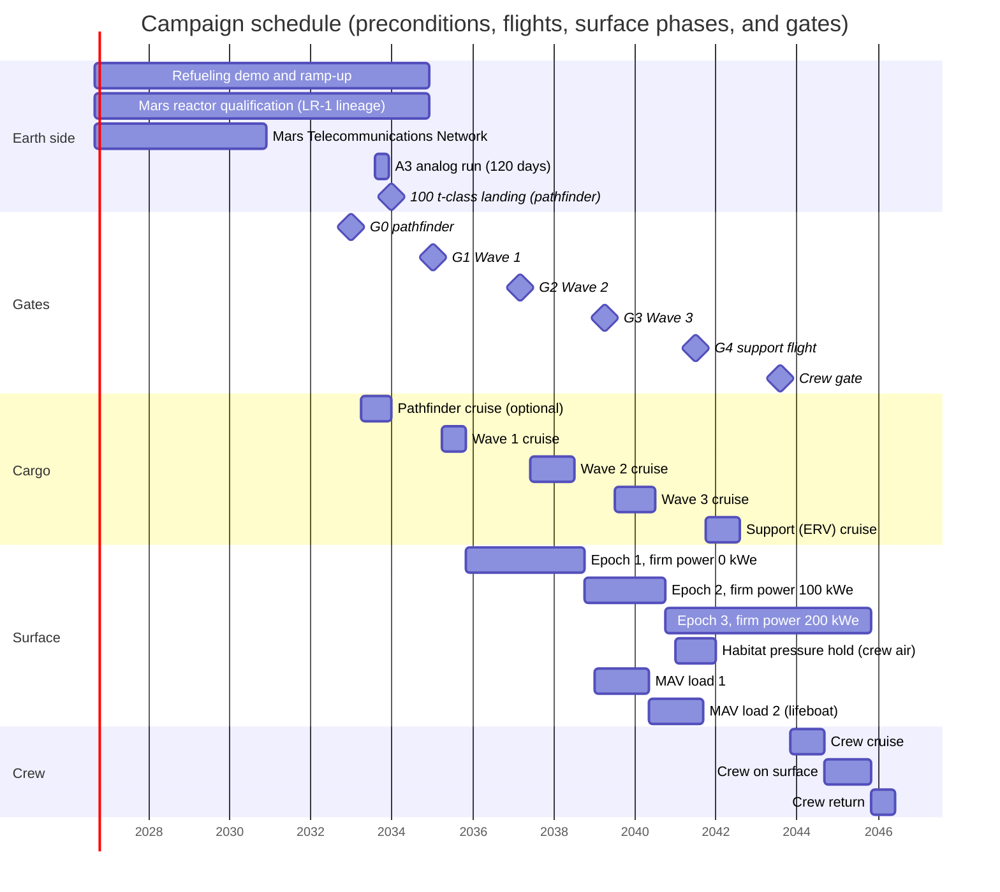

# 13. Timeline and gates

*Last reviewed: September 26, 2026*

*Scenario, mission control and Arcadia Planitia, August 2043.* The launch decision review takes four hours on Earth, and every question to the colony costs 36 minutes of round-trip light time. Nobody on Earth asks the Orchestrator for an opinion; they ask for readings. Reactor 3 has carried firm power for three years, and the habitat has held crew air since January 2041. The ascent vehicle's methane and oxygen have sat in its tanks for three years; the Earth return vehicle has circled Mars for one. The colony came through the February conjunction and an April regional dust storm without a single command from Earth. The last question of the day goes to the lifeboat tanks, and the answer comes back: a pressure trace that has not moved in two years. Four people will leave in November.

Each piece of the colony has a date by which it must exist, and each flight has conditions that must hold before it leaves Earth. Ships leave for Mars only in launch windows about 26 months apart, so a wave that misses its window waits two years.

In brief: three cargo waves launch in April 2035, June 2037, and July 2039; a support flight carries the Earth return vehicle and a support lander in October 2041; and the first crew of four departs in November 2043, if the crew gate passes about three months earlier. Four items can hold the first wave: orbital refueling, a Mars-qualified reactor, site autonomy, and heavy-lander entry, descent, and landing (EDL). If any of them is late, the whole sequence moves by one or two windows, and the first crew departs in January 2046 or around April 2048.

## Requirements

The launch windows, the three waves and their firm-power steps of 0, 100, and 200 kWe, the propellant schedule, and the six technical crew gate conditions come from [chapter 2](02.%20Baseline%20and%20budgets.md); [chapter 12](12.%20Human%20readiness%20and%20health.md) adds nine human criteria. Dates this chapter adds are marked as assumptions. All wave and crew gate criteria must be achievable at autonomy level A3, as defined in [chapter 1](01.%20Mission%20concept%20and%20autonomy.md).

## Windows about 26 months apart set the calendar

A minimum-energy trip from Earth to Mars is possible only when the two planets line up, which happens once per synodic period of 779.9 days, or 25.6 months [2]: in NASA's summary, a window about every 26 months [3]. Because Mars's orbit is eccentric, individual gaps between optimum departure dates run from 22 to 28 months, and the calendar does not favor even or odd years.

| Opportunity | Optimum departure | Characteristic energy C3 (km²/s²) | Arrival | Role in this plan |
|---|---|---:|---|---|
| 2033 | Apr 28, 2033 | 7.8 | Jan 2034 | Optional pathfinder |
| 2035 | Apr 21, 2035 | 10.2 | Nov 2035 | Wave 1 |
| 2037 | Jun 18, 2037 | 14.8 | Jul 2038 | Wave 2 |
| 2039 | Jul 15, 2039 | 12.2 | Jul 2040 | Wave 3 |
| 2041 | Oct 19, 2041 | 9.8 | Aug 2042 | Support: Earth return vehicle (ERV) and a support lander with food and spares |
| 2043 | Nov 15, 2043 | 9.0 | Sep 2044 | First crew |
| 2045/46 | Jan 22, 2046 | 8.6 | Dec 2046 | Crew rotation and expansion; at least 2 t of food, which covers a missed return window |
| 2048 | ~Apr 4, 2048 | ~7.9 | ~Jan 2049 | Expansion |

The 2037 and 2039 windows are the most expensive of the period, with C3 90% and 56% higher than in 2033. Cargo ships take on only the propellant their transfer needs, so the landed payload stays the same and the cost appears as tanker flights: 8 or 9 per ship at 100 t per tanker, 9 in 2037, 2039, and 2041 ([chapter 4](04.%20Transportation%20and%20landing.md)). Real launch periods span 3–6 weeks around each optimum [1].

Two recurring Mars events shape the surface schedule. Solar conjunction stops commands from Earth for about two weeks every ~26 months ([chapter 10](10.%20Communications.md)). The dust season falls in southern spring and summer, when Mars is near perihelion. Regional storms that last weeks happen every Mars year, and planet-encircling storms about once every three [20]; the last three came in 2001, 2007, and 2018 [4], [5]. The dates below are computed from a two-body ephemeris that reproduces the 2019–2026 conjunctions and from the 687-day Mars year, counted from the start of Mars Year 37 on December 26, 2022.

| Mars year | Dust season (southern spring and summer, approx.) | Solar conjunction (approx.) | Campaign phase |
|---|---|---|---|
| 43 | Apr 2035–Feb 2036 | Aug 19, 2034 | Pathfinder on surface; Wave 1 lands in the dust season |
| 44 | Mar 2037–Jan 2038 | Sep 24, 2036 | Wave 1 operations |
| 45 | Jan 2039–Nov 2039 | Nov 1, 2038 | Wave 2 operations |
| 46 | Dec 2040–Oct 2041 | Dec 18, 2040 | Wave 3 operations; firm 200 kWe |
| 47 | Nov 2042–Sep 2043 | Feb 21, 2043 | Crew gate evidence period |
| 48 | Sep 2044–Jul 2045 | May 2, 2045 | Crew on surface |

Wave 1 arrives in November 2035, late in a dust season, so its landers must be able to land and deploy under a dusty sky. The first crew lands in September 2044, just as the next dust season begins.

## Earth-side preconditions, 2026–2034

The 2035 start depends on five capabilities on Earth or the Moon existing in time. The plan's cargo masses fit any heavy lander, which matters because in February 2026 SpaceX said it had shifted its focus to the Moon and would begin building a Mars city in about five to seven years [6].

> Assumption: Wave 1 departs in April 2035, the earliest window that leaves time to qualify a Mars reactor on the Lunar Reactor-1 lineage by 2034 and to make orbital refueling routine.

| Precondition | Status, Sep 2026 | Needed by | If late |
|---|---|---|---|
| Ship-to-ship cryogenic propellant transfer, then routine refueling at 8 or 9 tanker flights per ship | Transfer inside one vehicle done on Starship Flight 3 (March 2024); the ship-to-ship demonstration slipped from March 2025 to March 2026 [19] and was still unscheduled in September 2026 [9] | Demonstration by 2030; routine operations by the Wave 1 gate, January 2035 | Wave 1 slips to 2037 or 2039 |
| 100 kWe-class reactor qualified for Mars | The August 2025 directive asked for a lunar reactor of at least 100 kWe by about 2030 [7], reaffirmed by NASA and the Department of Energy in January 2026 [8]. The first unit, Lunar Reactor-1 (LR-1), is to land on the Moon in 2030 [16]; its August 2026 draft procurement reportedly asks for at least 20 kWe [17], with no hardware contract. Units of the 100 kWe class are a 2030s goal [18] | Mars unit qualified by 2034, building on LR-1; no 100 kWe lunar flight required | Wave 1 flies several 20 kWe-class units at a higher mass per kilowatt, or slips (chapter 5) |
| Mars Telecommunications Network | Blue Origin selected September 1, 2026; delivery by December 31, 2028; operational at Mars by 2030 [10]; award under protest at the U.S. Government Accountability Office since September 11, 2026, contract suspended until a ruling due by about December 20, 2026 [11] | Operational by 2031 | No wave slips; Wave 1 uses its direct-to-Earth terminal (chapter 10) |
| Heavy-lander EDL on Mars | Heaviest mass landed so far is Perseverance, a 1,025 kg rover [12] | At least one successful 100 t-class landing before the Wave 1 gate | Wave 1 becomes an EDL test; the sequence slips one window |
| Site autonomy at A3 | Building blocks in Earth tests; not demonstrated on any planetary surface (chapter 1) | 120-day uncrewed analog run of a Wave 1 robot set, by 2033 | Wave 1 flies with more Earth supervision; the crew gate slips |

Four of these are on the critical path: refueling, the reactor, EDL, and autonomy. The register rates each at impact 4 or 5 ([R08](Appendix%20A.%20Risk%20register.md#r08), [R16](Appendix%20A.%20Risk%20register.md#r16), [R14](Appendix%20A.%20Risk%20register.md#r14), [R17](Appendix%20A.%20Risk%20register.md#r17)). The relay network is off the critical path because the colony carries an independent path to Earth ([R18](Appendix%20A.%20Risk%20register.md#r18)).

## Six decisions, each about three months before a window

A gate is a decision taken on Earth, from evidence logged on Mars, to commit the next flight: G0 for the optional pathfinder, G1 to G3 for the cargo waves, G4 for the support flight, and the crew gate.

> Assumption: Each gate decision is taken about three months before the optimum departure of the window it commits, the same lead [chapter 2](02.%20Baseline%20and%20budgets.md) uses for the crew gate.

| Gate | Decision (approx.) | Commits | Evidence period on Mars |
|---|---|---|---|
| G0 | Jan 2033 | Optional pathfinder | none (Earth-side only) |
| G1 | Jan 2035 | Wave 1 | Pathfinder data, if flown (landed Jan 2034) |
| G2 | Mar 2037 | Wave 2 | ~16 months of Wave 1, including the well proof |
| G3 | Apr 2039 | Wave 3 | ~9 months of Wave 2 plus Wave 1 history |
| G4 | Jul 2041 | Support flight (ERV and support lander) | ~12 months of Wave 3 |
| Crew gate | Aug 2043 | First crew | the full campaign; chapter 2 and chapter 12 criteria |

Who holds the gates is still open (see "Open questions"); the plan asks only that the gate authority be agreed before G1.

## Pathfinder, 2033 (optional)

One heavy lander departs about April 28, 2033, in the cheapest window of the period, and lands in January 2034. It carries survey robots, a small solar-powered in situ resource utilization test, and a communications node.

The pathfinder's main job is to prove that a 100 t-class lander can enter, descend, and land on Mars at the reference site. For the Wave 1 gate it must land intact within the planned ellipse, confirm with ground-penetrating radar and drill data that ice lies within reach of Rodwell wells at the reference site ([chapter 3](03.%20Site%20selection.md)), and run its robots at A3 for at least 120 sols, including the August 2034 conjunction without commands.

If the pathfinder does not fly, the Wave 1 gate needs equivalent evidence from someone else's heavy landing, such as a SpaceX Mars flight in the 2031 or 2033 window. The reactor then rides the second Wave 1 ship, so the first touchdown's data can update its aim point ([chapter 4](04.%20Transportation%20and%20landing.md)). Without the pathfinder, Wave 1 also loses the drilled primary site and commits to Arcadia with ice confirmed only by orbital data and its own survey. The backup region, Deuteronilus Mensae, stays an orbital judgment either way (chapter 3, [R05](Appendix%20A.%20Risk%20register.md#r05)).

## Wave 1, 2035: power, water, oxygen, robots

Three landers depart about April 21, 2035, and land in November 2035 with about 250 t: reactor 1, a solar field, water wells, the oxygen line, construction robots, a pad kit, and the communications terminal.

On the surface, the robots start reactor 1 at 100 kWe and raise a solar field with a sol-average output of 30–40 kW and about 1 MWh of batteries. They drill two Rodwell wells, which melt buried ice with reactor waste heat and pump the water up at a modeled ~0.38 m³ per day each [13]. The solid oxide electrolysis oxygen line is commissioned at low duty on solar in late 2035 and reaches 2 kg/h in about April 2036, once reactor 1 is at full power, about 170 times the best rate of its predecessor on Perseverance ([chapter 6](06.%20ISRU%20and%20life%20support.md)), and the robots build the landing pad for Wave 2.

With one reactor, firm power is zero. If reactor 1 trips in clear weather, the critical load of 9–14 kW runs on solar and batteries while the robots hibernate; a trip during a τ≈5 storm is the one case the power budget does not close, carried as accepted risk [R27](Appendix%20A.%20Risk%20register.md#r27) ([chapter 2](02.%20Baseline%20and%20budgets.md#the-storm-case)).

### Exit criteria for gate G2 (March 2037)

> Assumption: The thresholds below are set so that each can be met at A3 in about 16 months on the surface, and each maps to a chapter 2 budget. Criterion 2 tests chapter 2's assumption that at least 3,000 t of ice is mapped before Wave 2 commits.

1. Reactor 1 has delivered at least 90% of rated output for six months in total, and the colony has carried its critical loads through at least one reactor shutdown on solar and batteries alone.
2. Two wells have delivered at least 80% of their modeled output (a combined ~0.6 m³ per day or more) for at least six months, and drilling has mapped ice able to supply at least 3,000 t of water within 5 km ([chapter 3](03.%20Site%20selection.md)).
3. The oxygen line has run at 2 kg/h for at least six months in total, with at least 8 t of O₂ in storage.
4. At least two of the four Wave 2 landing sites are complete and inspected, and the rock armor on the other two is on schedule to be finished and inspected before the Wave 2 landers arrive ([chapter 8](08.%20Manufacturing%20and%20construction.md)).
5. The colony operated through the September 2036 conjunction with no commands from Earth and no loss of a critical function.
6. The communications system has met its phase F2 exit criterion ([chapter 10](10.%20Communications.md)).

A G2 failure on criteria 1 or 3 shifts Wave 2's manifest toward spares and repair robots and pushes the crew gate evidence period later; the wave still flies, because its cargo includes a second reactor and more wells. A failure on criterion 2 stops it: without confirmed ice, Wave 2 does not commit to the site (chapter 3).

## Wave 2, 2037: second reactor, habitat, propellant plant

Four landers depart about June 18, 2037, and land in July 2038 with about 240 t: reactor 2, habitat shells, the methane and oxygen propellant plant, a greenhouse module, and more robots. The colony's first relay orbiter departs in the same window ([chapter 10](10.%20Communications.md)).

From late 2038, once reactor 2 has finished commissioning, firm power is 100 kWe, and critical loads never again depend on solar power. The habitat, an Ice Home-class inflatable shielded by frozen water ([chapter 7](07.%20Habitat.md)), is pressurized first; its water cells are filled and frozen afterward, taking about 650 t of water from the ~700 t banked before it lands.

The propellant plant lands with its cryogenic storage tanks, commissions for about six months, and starts its full-rate campaign in January 2039. [Chapter 2](02.%20Baseline%20and%20budgets.md)'s budget carries it on two reactors: if one trips, the other still covers the critical loads and the plant, while construction and the oxygen line wait. Load 1 goes into the storage tanks, because the ascent vehicle does not land until July 2040.

> Assumption: The habitat is pressurized with filtered Mars gas from late 2038 while its water cells fill, passes its proof-pressure test in mid-2040, and switches to crew atmosphere by January 2041. Its formal 12-month pressure-hold record, run in the gas the crew will breathe, completes in January 2042, about 19 months before the crew launch decision (chapter 7).

### Exit criteria for gate G3 (April 2039)

1. Reactor 2 is online. The colony has shown that either reactor alone carries the critical load of 23–32 kW plus the propellant plant.
2. Four wells produce about 1.5 m³ per day.
3. The habitat shell is erected, holds filtered Mars gas at pressure within its leak specification, and its water cells are filling on schedule.
4. The propellant plant has produced methane and oxygen at its design rate for at least 30 days, and the product meets the Mars ascent vehicle (MAV) propellant specification that [chapter 4](04.%20Transportation%20and%20landing.md) adopts from the NASA reference design [14].
5. The colony operated through the November 2038 conjunction with no commands from Earth.
6. Colony relay 1 is in service (phase F3).

As at G2, a miss on criteria 1, 2, 5, or 6 shifts Wave 3's manifest toward spares and repair robots; the wave flies either way, because the crew gate needs the third reactor and the ascent vehicle. A habitat that misses criterion 3 uses up slack in its 12-month pressure hold, which must start by about August 2042. A miss on criterion 4 is the hardest to recover from, and "Schedule logic" dates the options.

## Wave 3, 2039: ascent vehicle, third reactor, outfitting

Four landers depart about July 15, 2039, and land in July 2040 with about 280 t: the MAV, reactor 3, habitat outfitting, a medical bay, and spares.

From late 2040, once reactor 3 has finished commissioning, firm power is 200 kWe. The MAV is the colony's only way off the surface, and its lifeboat reserve is a second load of propellant for the same vehicle ([R28](Appendix%20A.%20Risk%20register.md#r28)). The vehicle lands with empty tanks. The lander crane and a trailer move it, like a reactor, to a pad the robots have finished in the landing field, where it is filled from load 1 ([chapter 4](04.%20Transportation%20and%20landing.md), [chapter 8](08.%20Manufacturing%20and%20construction.md)). The plant goes on making load 2 until about September 2041 [14]. The vehicle then holds load 1 for more than three years under periodic checks.

### Exit criteria for gate G4 (July 2041)

1. Reactor 3 is online and firm power of 200 kWe has held for at least 9 months.
2. The MAV has landed, and its tanks, engines, and avionics have passed inspection by independent sensors.
3. MAV load 1 is aboard the vehicle and verified by independent sensors, and at least 80% of load 2 is made.
4. The habitat's ice shell is filled, it has passed its proof-pressure test, and it holds crew atmosphere with leak rate within specification.
5. The colony operated through the December 2040 conjunction with no commands from Earth.
6. Colony relay 2 is in service and the network has met its phase F4 exit criterion ([chapter 10](10.%20Communications.md)).

G4 commits the support flight: the ERV to Mars orbit and a support lander to the surface. The ERV is fueled on the Earth side, so its departure does not depend on Mars propellant.

## Support flight, 2041

Two or three ships depart about October 19, 2041. The ERV reaches Mars orbit in August 2042 and waits there about 3.2 years, until the crew leaves Mars in early November 2045. The support lander is not optional: it lands the surface half of the food reserve (~3.7 t), which crew gate criterion 5 inspects on Mars, and spares, including the ~3 t of robot spares that the [chapter 11](11.%20Maintenance%20and%20robotics.md#sizing-the-colonys-spares) ledger needs to carry the fleet through the crew's stay. Without it, criterion 5 cannot pass. A second lander, if flown, adds spares. If the propellant plant has failed, the support lander carries one MAV load of methane (7.0 t) from Earth in place of 7 t of spares ([chapter 4](04.%20Transportation%20and%20landing.md); see "Schedule logic"). The ERV and one lander need 17 tanker flights, 26 with a second lander ([chapter 4](04.%20Transportation%20and%20landing.md)). From here to the crew gate, the colony's work is mostly proving: both propellant loads are already in tanks, and every system builds the record the crew gate reads.

## The sustainability ladder measures independence from Earth

Where the gates decide launches, the ladder tracks how far the colony has moved toward running on what it makes, rung by rung from late 2038 to the crew gate. Rungs 4 to 6 overlap crew gate conditions 1, 3, and 2, because a colony that hosts crews for decades needs them anyway; a missed rung holds a launch only when it is also a gate condition.

| Rung | Measurable test | Target date |
|---|---|---|
| 1. Keep-alive autonomy | Critical loads carried on fission alone for ≥30 days of curtailment at storm posture, and ≥21 days with no uplink | Late 2038, once reactor 2 is commissioned (tested at the Nov 2038 conjunction if commissioning is done by then) |
| 2. Storm-proof | Critical loads sized and shown by analysis and drill to run through the 120-day storm at τ≈5 | Jul 2040 |
| 3. Water and air | Water ≥1.5 m³ per day and O₂ ≥17.5 t per year, each sustained for 12 months; ≥2 t of buffer gas (nitrogen and argon, 2.59% and 1.94% of the atmosphere [2]) captured | Jul 2041 |
| 4. Firm energy | 200 kWe firm for 12 months | Late 2041 |
| 5. Return capability | MAV load 1 and lifeboat reserve in tanks | Sep 2041 |
| 6. Habitable volume | 12-month pressure hold and a closed-loop life support run in the empty habitat (chapter 6) | before Aug 2043 |

> Assumption: Two further rungs belong to the crew and expansion eras: 20–25% of crew calories grown on site from 2044, the most [chapter 2](02.%20Baseline%20and%20budgets.md)'s 15–20 kW greenhouse can supply ([chapter 9](09.%20Food%20and%20agriculture.md)), and 25% of replacement-part mass made on site by 2048, a goal this book sets. Spares for two synods (about 52 months) are held on site from Wave 3 onward. The crew eats from a 7.3 t shelf-stable reserve that covers 1,000 days without any credit for the greenhouse, so the greenhouse is not a crew gate condition.

## The crew gate, 2043

Crew depart only when all 15 criteria, six technical conditions from [chapter 2](02.%20Baseline%20and%20budgets.md) and nine human criteria from [chapter 12](12.%20Human%20readiness%20and%20health.md#the-human-crew-gate), are true at the launch decision, about three months before the November 15, 2043, optimum.

| # | Crew gate condition (chapter 2) | Earliest date met | Latest date that still passes | Evidence |
|---|---|---|---|---|
| 1 | Firm fission power ≥200 kWe (three reactors, one more than needed) has run for ≥12 months | ~late 2041 | Firm power in place by ~Aug 2042 | Reactor logs; power budget in chapter 2 |
| 2 | Habitat held at its operating atmosphere (70 kPa, 26.5% O₂) for ≥12 months with leak rate within specification (≤1 kg per sol) | ~Jan 2042 (crew atmosphere from Jan 2041) | Crew atmosphere in place by ~Aug 2042 | Independent pressure sensors (chapter 7) |
| 3 | MAV fully loaded and lifeboat reserve in tanks, both verified by independent sensors | ~Sep 2041 (load 1 ~May 2040; load 2 ~Sep 2041) | Load 2 complete by the Aug 2043 decision | Mass gauging; product analysis |
| 4 | ERV in Mars orbit, fueled, and checked out | ~late 2042 | Aug 2043 | ERV telemetry (chapter 4) |
| 5 | Consumables at chapter 2 levels: ~5 t breathing O₂, ≥2 t buffer gas, ≥100 t water, ~7.3 t shelf-stable food | ~Aug 2042 (surface half of the food, landed by the 2041 support flight) | Aug 2043 for stores on Mars; the crew half of the food verified aboard the crew vehicle before the Nov 2043 launch | Stock records and inspection on Mars; crew vehicle loading records |
| 6 | Autonomy proven without Earth intervention: (a) ≥120 consecutive days with no commands, including a solar conjunction; (b) a storm-mode run of ≥30 days at design-storm solar levels with deferrable loads shed; (c) operation through any regional or global dust event that occurs | (a) Sep 2036 conjunction at Wave 1 scale, Dec 2040 at full scale; (b) after Jul 2040 at full scale; (c) each dust season from 2035 | (a) Feb 2043 conjunction; (b) by Aug 2043; (c) Nov 2042–Sep 2043 dust season | Command logs; power and load logs; τ records |

Chapter 2 also requires load 1 to have been held at temperature for at least six months at crew departure. Load 1 is finished about 42 months before departure, so the hold turns into a long test of cryogenic storage.

Firm power, the habitat atmosphere, and both propellant loads are all in place about two years before the decision (about 15 months if the MAV's dry mass grows to 12 t; [chapter 4](04.%20Transportation%20and%20landing.md)). That slack alone does not cover a total loss of the propellant plant, whose recovery "Schedule logic" dates ([R13](Appendix%20A.%20Risk%20register.md#r13)).

Condition 6 carries the other technical uncertainty. At about one planet-encircling storm every three Mars years [20], the full-scale colony has about 1.6 Mars years (July 2040 to August 2043) to meet one, so part (b) simulates the design storm, and the register carries the chance that no real storm tests the colony as [R39](Appendix%20A.%20Risk%20register.md#r39).

> Assumption: The dates for criteria 7–15 are this chapter's reading of chapter 12's measures against the schedule above. Each depends on hardware from Wave 3 or the support flight and on a record of the length chapter 12 sets.

| # | Human criterion (chapter 12) | Earliest date met | Latest date that still passes |
|---|---|---|---|
| 7 | Radiation: dose projected from ≥1 Mars year of habitat dosimetry, within 600 mSv or under a signed waiver; shelter below the 250 mSv solar particle event limit | ~mid-2042 | Dosimetry running by ~Oct 2041; waivers signed by Aug 2043 |
| 8 | Life support ≥12 months at 4-crew simulated load | ~early 2043 | Simulators running by ~Aug 2042 |
| 9 | Water and air within crew limits for ≥6 months | ~Jul 2041 | Clean run started by ~Feb 2043 |
| 10 | Medical bay, surgical robot, exercise equipment; pharmacy flies with the crew | After Jul 2040 (Wave 3) | Aug 2043 |
| 11 | Dust control after ≥50 simulated extravehicular activity cycles | After Jul 2040 | Aug 2043 |
| 12 | Suits and pressurized rover pre-positioned and checked | Jul 2040 or Aug 2042, as suits arrive | Aug 2043 |
| 13 | Zoning map, quarantine capability, approved planetary protection plan | Map from Wave 1 surveys; approval on Earth | Aug 2043 |
| 14 | Private links; crew trained together in a ≥12-month analog | ~2040 | Analog under way by ~Aug 2042 |
| 15 | Crew and Orchestrator protocols rehearsed in a full-mission simulation | After crew selection | Aug 2043 |

Engineering on Mars cannot close criterion 7. No shielding case brings the mission under NASA's 600 mSv career limit (chapter 12), so the criterion passes only through its waiver: each crew member accepts the projected dose in writing, and whoever flies them agrees to fly above the limit. Chapter 12 calls that decision the question most likely to move the crew date.

The gate covers return propellant for a MAV only; refilling a full ship on Mars, about 1,600 t, is an expansion goal for [chapter 15](15.%20Terraforming%20and%20the%20long%20view.md).

## Crew and after, 2043–2048

The crew of four departs about November 15, 2043, and lands about September 16, 2044. They stay about 410 days, leave Mars on a low-energy departure in early November 2045, and reach Earth about June 2046, some 940–950 days after launch ([chapter 2](02.%20Baseline%20and%20budgets.md)).

The next crew leaves on January 22, 2046, and lands in December 2046 with rotation and expansion cargo; the window around April 4, 2048, is the next expansion slot. Short-stay (opposition-class) missions are not part of this plan: they need much higher velocity change than conjunction-class trips and allow only a short stay at Mars [15].

Past the ladder's rungs, the colony still depends on Earth for electronics, precision parts, and people; shrinking that list is the work of the expansion era in [chapter 15](15.%20Terraforming%20and%20the%20long%20view.md).

## Schedule logic: what slips, and by how much

Each gate reads evidence from the wave before it, and the windows are fixed, so a late link in the chain moves everything after it by whole windows.

| If this is late | First affected | Result | First crew departs |
|---|---|---|---|
| Nothing | none | Baseline | Nov 2043 |
| Routine refueling not ready by Jan 2035 | Wave 1 | Waves move to 2037, 2039, 2041; support to 2043 | Jan 2046 |
| Refueling not ready by Mar 2037 | Wave 1 | Waves move to 2039, 2041, 2043; support to 2045/46 | ~Apr 2048 |
| No 100 kWe-class Mars reactor qualified by 2034 | Wave 1 | Wave 1 flies several 20 kWe-class units at higher mass, or waves move to 2037, 2039, 2041 | Nov 2043 if the units fit Wave 1's mass; otherwise Jan 2046 |
| No 100 t-class landing before Jan 2035 | Wave 1 | 2035 flight becomes the EDL test; waves move to 2037, 2039, 2041 | Jan 2046 |
| A3 not shown in the 2033 analog run | Wave 1 flies, but slower | Habitat and propellant slip about one synod | Jan 2046 (likely) |
| Mars Telecommunications Network late | none | Colony uses direct link and its own relays; less data | Nov 2043 |
| Propellant plant fails before G3; replacement flies with Wave 3 | Crew gate | Replacement makes one load by ~May 2042; methane for the other lands with the support flight in Aug 2042 | Nov 2043 |
| Propellant plant fails after load 1 is made | Crew gate | Methane for load 2 lands with the support flight; oxygen from the oxygen line | Nov 2043 |
| Propellant plant fails after G3 and before load 1 | Crew gate | Support-flight methane makes one load; no lifeboat reserve by the decision | Jan 2046 |

In the plant rows, a replacement can fly with Wave 3 only if the failure shows before G3 in April 2039, three months after production starts. Landing in July 2040 and commissioned about January 2041, the replacement could not finish two 480-day runs before about September 2043, after the decision. It makes one load by about May 2042; for the other, the support flight lands 7.0 t of methane in August 2042, and the oxygen line, at about 17.5 t a year, supplies the 22.7 t of oxygen. The cost is the support flight's spares: the robots run below [chapter 11](11.%20Maintenance%20and%20robotics.md)'s spares floor during the crew's stay.

A slip also shifts launch energy: a campaign that starts in 2037 pays the 2037 tanker penalty in its first wave and moves its last flights into the cheaper 2041 and 2043 windows ([chapter 4](04.%20Transportation%20and%20landing.md)).

An autonomy shortfall that slows construction eats into the crew gate's two years of slack before it moves the crew date. [Chapter 1](01.%20Mission%20concept%20and%20autonomy.md) assumes that a stall at A2 roughly halves the construction rate, which would use up the slack and move the crew to the 2045/46 window ([R17](Appendix%20A.%20Risk%20register.md#r17)).

## What would change this conclusion

A demonstrated ship-to-ship transfer and a 100 t-class Mars landing before 2031 would make the 2033 window available for Wave 1 and move the first crew to the 2041 window. A failure of the Rodwell wells at the reference site would move it the other way, by at least one window and probably two.

## Autonomy

### What A3 must do

At A3, site autonomy for known work, the fleet runs the site for months without contact (at least 120 days), including four conjunctions before the crew gate, and recovers from anticipated faults with procedures written on Earth. It also produces the gate evidence: continuous logs from independent sensors, reported in a form Earth can audit. The Orchestrator does not certify its own gates; Earth reads the data and decides.

### What A4 adds

At A4, open-ended autonomy, the colony repairs faults no procedure covers, and the schedule wins back margin. If a cryocooler on the propellant tanks fails in 2042, the colony designs around it in weeks instead of waiting for a spare from Earth in the 2043 window, and condition 3 stays intact. A4 could also compress the habitat and outfitting work enough to make a slipped campaign catch up by one window.

### What an A5 mind could change

An A5 mind could propose its own gate criteria, argue from evidence that a gate is too strict or too lax, and design the next wave's cargo on Mars before Earth builds it. The gates stay with Earth until the crew gate is passed.

## Evidence and readiness

The ratings come from the system chapters.

| Element | TRL (technology readiness level) | Owner chapter |
|---|---|---|
| Ship-to-ship cryogenic propellant transfer | 4–5 (not flown; intra-vehicle transfer only, 2024) | [4](04.%20Transportation%20and%20landing.md) |
| Heavy-lander Mars EDL, 100 t class | 3 (heaviest Mars landing 1,025 kg) | [4](04.%20Transportation%20and%20landing.md) |
| ERV with multiyear cryogenic hold at Mars | 2–3 | [4](04.%20Transportation%20and%20landing.md) |
| 100 kWe closed-Brayton surface reactor | 2–3 (concept; no hardware) | [5](05.%20Power.md) |
| 20 kWe closed-Brayton reactor (LR-1 lineage) | 3–4 | [5](05.%20Power.md) |
| Rodwell water extraction for Mars | 4–5 (model plus Earth lab and thermal-vacuum tests) | [6](06.%20ISRU%20and%20life%20support.md) |
| MAV-scale methane and oxygen plant | 4–5 | [6](06.%20ISRU%20and%20life%20support.md) |
| Ice Home integrated habitat | 2–3 | [7](07.%20Habitat.md) |
| Site autonomy for months without contact (A3) | 2–3 (no field evidence) | [1](01.%20Mission%20concept%20and%20autonomy.md) |

The reactor and site autonomy, both at TRL 2–3, are the first items that can hold the schedule: the reactor must be proven by 2034 and site autonomy by 2033, both before Wave 1.

## Risks

Before Wave 1 flies, the schedule turns on the four critical-path preconditions ([R08](Appendix%20A.%20Risk%20register.md#r08), [R16](Appendix%20A.%20Risk%20register.md#r16), [R14](Appendix%20A.%20Risk%20register.md#r14), [R17](Appendix%20A.%20Risk%20register.md#r17)). After Wave 1, the dates turn on the propellant plant ([R13](Appendix%20A.%20Risk%20register.md#r13)) and on whether a real storm tests the colony before the decision ([R39](Appendix%20A.%20Risk%20register.md#r39)). The crew-era data target also needs one 70 m-class Deep Space Network track a day, contracted years ahead ([chapter 10](10.%20Communications.md), [R07](Appendix%20A.%20Risk%20register.md#r07)). [Chapter 14](14.%20Critical%20challenges.md) weighs the risks that are not about dates, and [Appendix A](Appendix%20A.%20Risk%20register.md) scores them all.

## Open questions

- Will routine refueling, at 8 or 9 tanker flights per ship, exist by 2035, and at what cadence per window?
- Whether a 100 kWe-class reactor is qualified for Mars by 2034 is [chapter 5's open question](05.%20Power.md#open-questions); Wave 1's date depends on the answer.
- Can a pathfinder be funded and built for the 2033 window, six and a half years from now?
- Can a launch campaign sustain the roughly 5–6 launches per week, for about two months, that the tanker flights of Waves 2 and 3 require ([chapter 4](04.%20Transportation%20and%20landing.md))?
- Is a 30-day simulated storm run enough evidence for a crew if no real planet-encircling storm occurs before the decision ([R39](Appendix%20A.%20Risk%20register.md#r39))?
- Who holds the gates over a 17-year campaign: a space agency, a company, an international board ([R16](Appendix%20A.%20Risk%20register.md#r16))?

## References

[1]: https://ntrs.nasa.gov/api/citations/20100037210/downloads/20100037210.pdf "Burke, Falck, and McGuire, Interplanetary Mission Design Handbook: Earth-to-Mars Mission Opportunities 2026 to 2045, NASA/TM-2010-216764, NASA 2010"
[2]: https://nssdc.gsfc.nasa.gov/planetary/factsheet/marsfact.html "NASA NSSDC, Mars Fact Sheet"
[3]: https://science.nasa.gov/planetary-science/programs/mars-exploration/mission-timeline/ "NASA Science, Mars Mission Timeline"
[4]: https://ntrs.nasa.gov/api/citations/20190027303/downloads/20190027303.pdf "Smith and Guzewich 2019, The Mars Global Dust Storm of 2018, International Conference on Environmental Systems"
[5]: https://ntrs.nasa.gov/api/citations/20210012819/downloads/21-56.pdf "Wolkenberg et al. 2020, Similarities and Differences of Global Dust Storms in MY 25, 28, and 34, NASA"
[6]: https://www.cnn.com/2026/02/08/science/elon-musk-spacex-priorities-moon-intl-hnk "CNN, Elon Musk Says SpaceX Prioritizing the Moon, Pivots Away from His Mars Settlement Ambition, February 8, 2026 (press; company announcement)"
[7]: https://www.nasa.gov/wp-content/uploads/2025/08/nasa-fsp-directive-aug42.pdf "NASA, Directive on Fission Surface Power (FSP) Development, August 4, 2025"
[8]: https://www.nasa.gov/news-release/nasa-department-of-energy-to-develop-lunar-surface-reactor-by-2030 "NASA, NASA, Department of Energy to Develop Lunar Surface Reactor by 2030, January 13, 2026"
[9]: https://en.wikipedia.org/wiki/Starship_Propellant_Transfer_Demonstration "Wikipedia, Starship Propellant Transfer Demonstration (status as of September 2026; secondary source for flight status)"
[10]: https://www.nasa.gov/news-release/nasa-selects-blue-origin-as-mars-telecommunications-network-provider/ "NASA, NASA Selects Blue Origin as Mars Telecommunications Network Provider, September 1, 2026"
[11]: https://satnews.com/2026/09/14/rocket-lab-files-gao-bid-protest-over-nasas-700m-mars-orbiter-award-to-blue-origin/ "SatNews, Rocket Lab Files GAO Bid Protest over NASA's $700M Mars Orbiter Award to Blue Origin, September 14, 2026 (protest filed September 11; GAO has up to 100 days)"
[12]: https://www.jpl.nasa.gov/news/press_kits/mars_2020/launch/mission/spacecraft/perseverance_rover/ "NASA JPL, Mars 2020 Perseverance Launch Press Kit: Perseverance Rover"
[13]: https://ntrs.nasa.gov/api/citations/20180007948/downloads/20180007948.pdf "Hoffman, Andrews, and Watts 2018, Simulated Water Well Performance on Mars, AIAA SPACE Forum 2018"
[14]: https://ntrs.nasa.gov/api/citations/20170001421/downloads/20170001421.pdf "Kleinhenz and Paz, An ISRU Propellant Production System to Fully Fuel a Mars Ascent Vehicle, AIAA 2017"
[15]: https://ntrs.nasa.gov/api/citations/20150001240/downloads/20150001240.pdf "Mattfeld et al., Trades Between Opposition and Conjunction Class Trajectories for Early Human Missions to Mars, NASA 2015"
[16]: https://www.nasa.gov/wp-content/uploads/2026/03/america-underway-in-space-on-nuclear-power.pdf "NASA, America Underway in Space on Nuclear Power: SR-1 Freedom and LR-1, 2026"
[17]: https://newspaceeconomy.ca/2026/09/01/what-does-nasas-sparc-lunar-reactor-procurement-reveal-about-lunar-reactor-1/ "New Space Economy, What Does NASA's SPARC Lunar Reactor Procurement Reveal About Lunar Reactor-1?, September 1, 2026 (summary of the August 30, 2026 draft solicitation)"
[18]: https://spacepolicyonline.com/news/white-house-releases-space-nuclear-initiative/ "SpacePolicyOnline, White House Releases Space Nuclear Initiative, April 14, 2026 (event report)"
[19]: https://oig.nasa.gov/wp-content/uploads/2026/03/final-report-ig-26-004-nasas-management-of-the-human-landing-system-contracts.pdf "NASA Office of Inspector General, NASA's Management of the Human Landing System Contracts, IG-26-004, March 10, 2026"
[20]: https://www.nasa.gov/solar-system/the-fact-and-fiction-of-martian-dust-storms/ "NASA, The Fact and Fiction of Martian Dust Storms"
